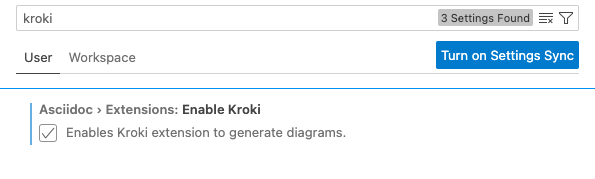
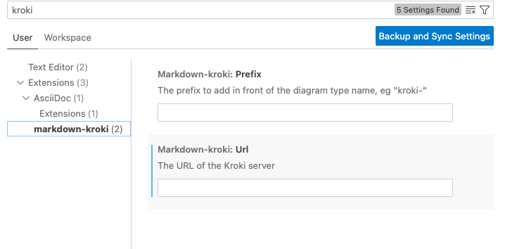

# SOARCA
Security Orchestrator for Advanced Response to Cyber Attacks


SOARCA the TNO orchestrator for Open-C2, CACAO and STIX

## Building / starting / stopping  
Install go via https://go.dev/doc/install 

Install the go plugin in VSCode

project layout https://github.com/golang-standards/project-layout

for installation and build instructions see: [see](build/build.md)


## Quick Run
```bash
make run
```


## Documentation
For documentation, we use Markdown + [plantUML](https://plantuml.com/). 

Documentation will be stored in the [doc](doc/) folder.

To get started with plantUML in Markdown please install the following components in VS-Code:


Markdown Kroki  
VS Marketplace Link: https://marketplace.visualstudio.com/items?itemName=pomdtr.markdown-kroki

Once you installed them please enable Kroki in the settings, and add the following to use a non-public Kroki server:






