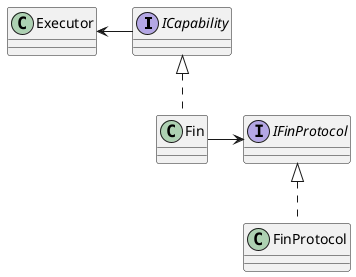

# Fin documentation

Extending SOARCA is done by developing a SOARCA-Fin. 

## Design
As seen in the overall design the fins are communicating via MQTT. 

The Fin capability design is based on the publish/ subscribe principle of MQTT. SOARCA will start the subscriber for modules to register itself and dynamically inject these into the list of available modules.

### Class

#### FinController
The FinController will open the `soarca` topic and listen for new fins. Also it is responsible for offering the fin list to the Fin capability.

#### Fin capability
The is used to communicate directly with an individual fin. I can have `blocking execution` to wait for results. 

## Protocol

See the [protocol document](fin-protocol.md).

## Loading your module
Once you have developed your module you need to load it so SOARCA can use it for the playbooks it executes. You can load your modules in two ways via docker or stand alone.

### Docker
The Docker engine allows for easy loading but requires you to package your capability into a docker container. Once that is done you can add your container to a docker compose file and it will register itself to SOARCA once started. The Fin MUST be loaded after SOARCA's main components otherwise the Fin might not work correctly. 

### Stand alone
SOARCA can be used without Docker. To use it whit your module you need to start it and have an MQTT broker running already before starting your Fin. *The method is for more complex setups and not recommended for first use.*

First set up SOARCA [stand alone](setup.md).

