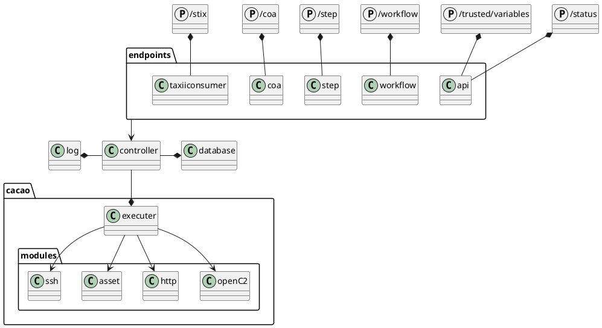
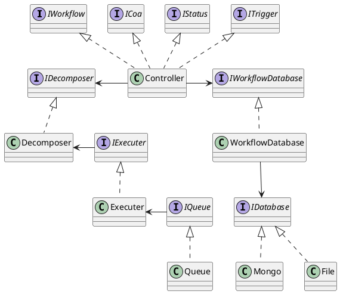

# Application design

The application consist of the endpoint which control the workflows/ Coarse of Actions and steps that are available.

## Component 

## Classes

This diagram consists of the class structure used by SOAR-CA

