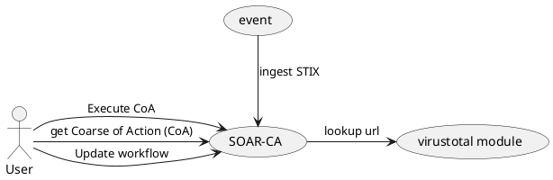

# SOAR-CA
The TNO Cyber ORCA.

## Goals of SOARCA
SOAR-CA or SOARCA stands for Security Orchestration Automation and Response CAcao. Which means it is a soar tool designed to work with OASIS CACAO. SOAR-CA also supports STIX.

##  Design decisions 
To allow for fast execution and type safe development SOAR-CA is developed in `GOLANG`. The application application can be deployed in `Docker`. Further dependencies are `MQTT` for the module system and `go-gin` for the REST API.

## Example use case
As a starting example for SOAR-CA is ingesting a STIX2 message with an malicious URL. In turn this will trigger a playbook which will produce several Coarse of Action which can be executed by the operator/ be automatically executed.

The main focus is to show the working of the API for:Workflows, CoAs and STIX endpoint in combination with the module system.

