## Endpoint description

We will use HTTP status codes https://en.wikipedia.org/wiki/List_of_HTTP_status_codes

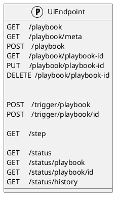

### General messages

#### Error
When an error occurs a 400 status is returned with the following JSON payload, the original call can be omitted in production for security reasons.

responses: 400/Bad request

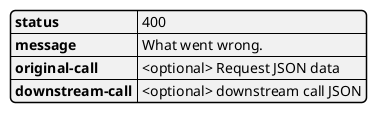

#### Unauthorized
When the caller does not have valid authentication 401/unauthorized will be returned.

#### cacao playbook JSON

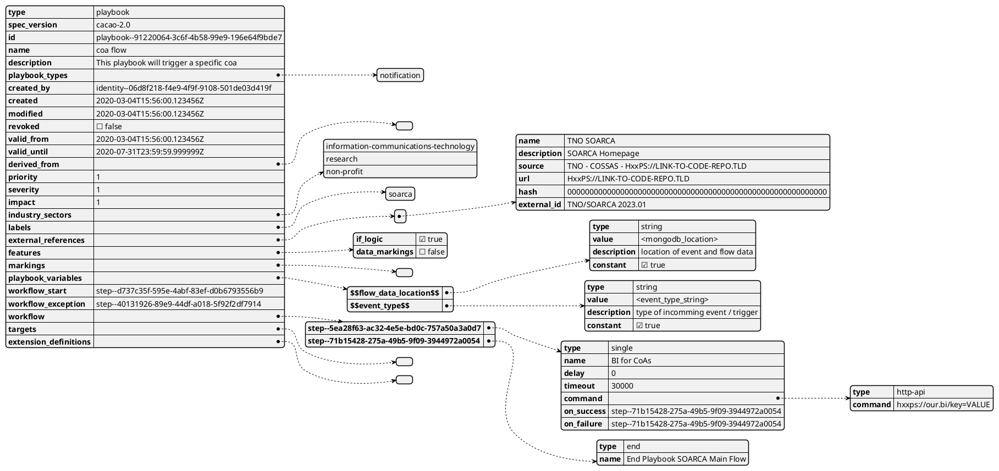
---- 

### /playbook
The playbook endpoints are used to create playbooks in SOARCA, new playbooks can be added, and current ones edited and deleted. 

#### GET `/playbook`
Get all playbook ids that are currently stored in SOARCA.

##### Call payload
None

##### Response
200/OK with payload:

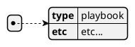

##### Error
400/BAD REQUEST with payload:
General error

#### GET `/playbook/meta`
Get all playbook ids that are currently stored in SOARCA.

##### Call payload
None

##### Response
200/OK with payload:

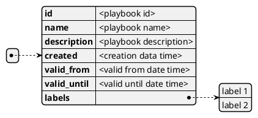

##### Error
400/BAD REQUEST with payload:
General error

#### POST `/playbook`
Create a new playbook and store it in SOARCA. The format is 

##### Payload

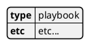

##### Response
201/CREATED

##### Error
400/BAD REQUEST with payload: General error, 409/CONFLICT if the entry already exists

#### GET `/playbook/{playbook-id}`
Get playbook details

##### Call payload
None

##### Response
200/OK with payload:

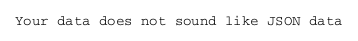
##### Error
400/BAD REQUEST

----

#### PUT `/playbook/{playbook-id}``
An existing playbook can be updated with PUT. 

##### Call payload
A playbook like [cacao playbook JSON](#cacao-playbook-json)

##### Response
200/OK with the edited playbook [cacao playbook JSON](#cacao-playbook-json)

##### Error
400/BAD REQUEST for malformed request

When updated it will return 200/OK or General error in case of an error.

----

#### DELETE `/playbook/{playbook-id}`
An existing playbook can be deleted with DELETE. When removed it will return 200/OK or general error in case of an error.

##### Call payload
None

##### Response
200/OK if deleted

##### Error
400/BAD REQUEST if the resource does not exist

---

#### POST `/trigger/playbook/xxxxxxxx-xxxx-Mxxx-Nxxx-xxxxxxxxxxxx` 
Execute playbook with a specific id

##### Call payload
None

##### Response
Will return 200/OK when finished with playbook playbook.

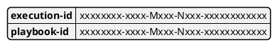

##### Error
400/BAD REQUEST general error on error.

---

#### POST `/trigger/playbook`
Execute an ad-hoc playbook

##### Call payload
A playbook like [cacao playbook JSON](#cacao-playbook-json)

##### Response
Will return 200/OK when finished with the playbook.

##### Error
400/BAD REQUEST general error on error.

----

### /step [NOT in SOARCA V1.0]
Get capable steps for SOARCA to allow a coa builder to generate or build valid coa's

#### GET `/step`
Get all available steps for SOARCA. 

##### Call payload
None

##### Response
200/OK

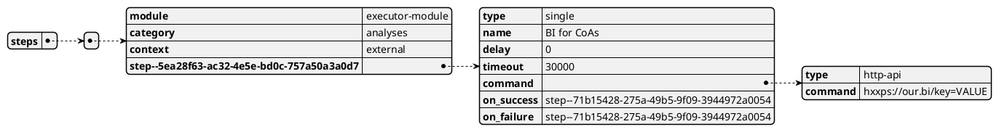

Module is the executing module name that will do the executor call.

Category defines what kind of step is executed:
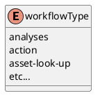
Context will define whether the call is internal or external:

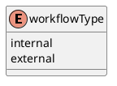

##### Error
400/BAD REQUEST general error on error.

----

### /status
The status endpoints are used to get various statuses. 

#### GET `/status`
Call this endpoint to see if SOARCA is up and ready. This call has no payload body.

##### Call payload
None

##### Response
200/OK

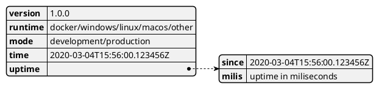

##### Error
5XX/Internal error, 500/503/504 message.

----

#### GET `/status/fins` | not implemented
Call this endpoint to see if SOARCA Fins are up and ready. This call has no payload body.

##### Call payload
None

##### Response
200/OK

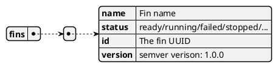

##### Error
5XX/Internal error, 500/503/504 message.

----

#### GET `/status/reporters` | not implemented
Call this endpoint to see which SOARCA reportes are used. This call has no payload body.

##### Call payload
None

##### Response
200/OK

##### Error
5XX/Internal error, 500/503/504 message.

----

#### GET `/status/ping`
See if SOARCA is up this will only return if all SOARCA services are ready

##### Call payload
None

##### Response
200/OK

`pong`

## Usage example flow

### Stand alone

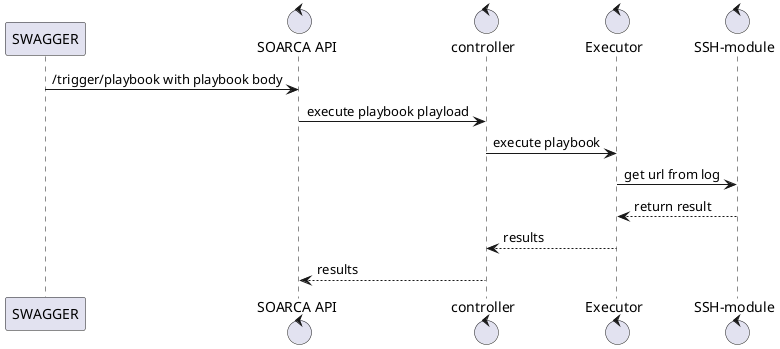

### Database load and execution

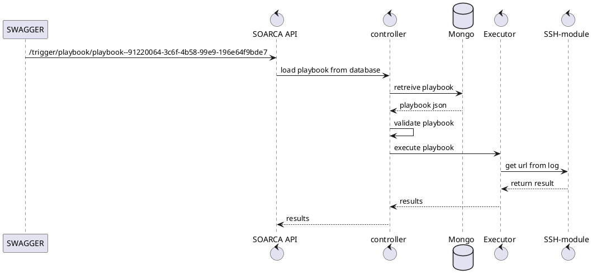