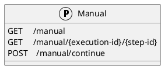
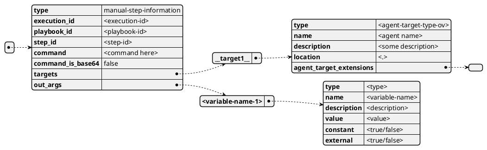
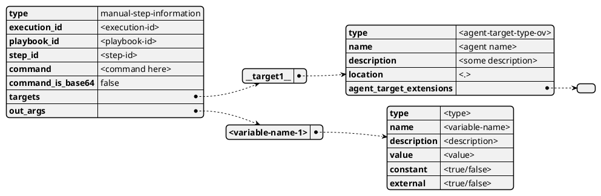
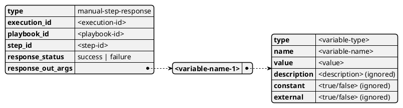

## Endpoint descriptions

We will use HTTP status codes https://en.wikipedia.org/wiki/List_of_HTTP_status_codes

### /manual
The manual interaction endpoint for SOARCA

#### GET `/manual`
Get all pending manual actions objects that are currently waiting in SOARCA.

##### Call payload
None

##### Response
200/OK with body a list of:

|field              |content                |type               | description |
| ----------------- | --------------------- | ----------------- | ----------- |
|type               |execution-status       |string             |The type of this content
|execution_id       |UUID                   |string             |The id of the execution
|playbook_id        |UUID                   |string             |The id of the CACAO playbook executed by the execution
|step_id            |UUID                   |string             |The id of the step executed by the execution
|description        |description of the step|string             |The description from the workflow step
|command            |command                |string             |The command for the agent either command 
|command_is_base64  |true/false             |bool               |Indicates if the command is in B64
|target            |cacao agent-target     |object         |Map of [cacao agent-target](https://docs.oasis-open.org/cacao/security-playbooks/v2.0/cs01/security-playbooks-v2.0-cs01.html#_Toc152256509) with the target(s) of this command
|out_args          |cacao variables        |dictionary         |Map of [cacao variables](https://docs.oasis-open.org/cacao/security-playbooks/v2.0/cs01/security-playbooks-v2.0-cs01.html#_Toc152256555) handled in the step out args with current values and definitions

##### Error
400/BAD REQUEST with payload:
General error

---

#### GET `/manual/<execution-id>/<step-id>`
Get pending manual actions objects that are currently waiting in SOARCA for specific execution.

##### Call payload
None

##### Response
200/OK with body:

|field              |content                |type               | description |
| ----------------- | --------------------- | ----------------- | ----------- |
|type               |execution-status       |string             |The type of this content
|execution_id       |UUID                   |string             |The id of the execution
|playbook_id        |UUID                   |string             |The id of the CACAO playbook executed by the execution
|step_id            |UUID                   |string             |The id of the step executed by the execution
|description        |description of the step|string             |The description from the workflow step
|command            |command                |string             |The command for the agent either command 
|command_is_base64  |true/false             |bool               |Indicates if the command is in B64
|targets            |cacao agent-target     |dictionary         |Map of [cacao agent-target](https://docs.oasis-open.org/cacao/security-playbooks/v2.0/cs01/security-playbooks-v2.0-cs01.html#_Toc152256509) with the target(s) of this command
|out_args          |cacao variables        |dictionary         |Map of [cacao variables](https://docs.oasis-open.org/cacao/security-playbooks/v2.0/cs01/security-playbooks-v2.0-cs01.html#_Toc152256555) handled in the step out args with current values and definitions

##### Error
404/Not found with payload:
General error

#### POST `/manual/continue`
Respond to manual command pending in SOARCA, if out_args are defined they must be filled in and returned in the payload body. Only value is required in the response of the variable. You can however return the entire object. If the object does not match the original out_arg, the call we be considered as failed.

##### Call payload
|field              |content                |type               | description |
| ----------------- | --------------------- | ----------------- | ----------- |
|type               |execution-status       |string             |The type of this content
|execution_id       |UUID                   |string             |The id of the execution
|playbook_id        |UUID                   |string             |The id of the CACAO playbook executed by the execution
|step_id            |UUID                   |string             |The id of the step executed by the execution
|response_status    |enum                   |string             |`success` indicates successfull fulfilment of the manual request. `failure` indicates failed satisfaction of the request
|response_out_args  |cacao variables        |dictionary         |Map of cacao variables names to cacao variable struct. Only name, type, and value are mandatory

##### Response
200/OK with payload: 
Generic execution information

##### Error
400/BAD REQUEST with payload:
General error