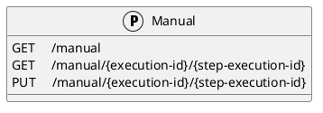
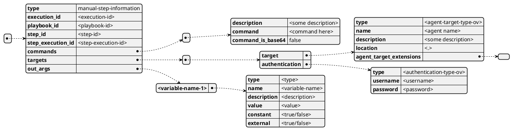
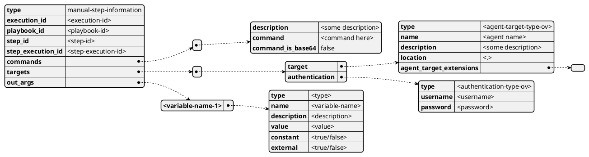
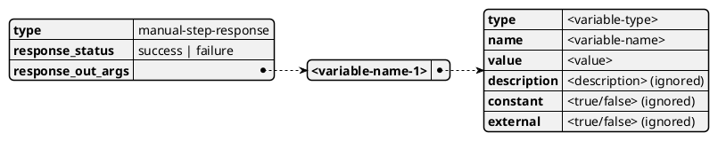

## Endpoint descriptions

We will use HTTP status codes https://en.wikipedia.org/wiki/List_of_HTTP_status_codes

```plantuml
@startuml
protocol Manual {
    GET     /manual
    GET     /manual/{execution-id}/{step-execution-id}
    PUT     /manual/{execution-id}/{step-execution-id}
}
@enduml
```

A pending manual command is identified by its `execution-id` and
`step-execution-id`, not `step-id` - a step invoked more than once during an
execution (e.g. a step inside a `while-condition` loop body, or, once
implemented, several parallel branches converging on the same step) mints a
fresh `step-execution-id` per invocation, so several pending commands can
legitimately share the same `step-id` at once. Use `GET /manual` to discover
which specific `step-execution-id` you need to act on when more than one is
pending for the same `step-id`.

### /manual
The manual interaction endpoint for SOARCA

#### GET `/manual`
Get all pending manual actions objects that are currently waiting in SOARCA.

##### Call payload
None

##### Response
200/OK with body a list of:

|field              |content                |type               | description |
| ----------------- | --------------------- | ----------------- | ----------- |
|type               |execution-status       |string             |The type of this content
|execution_id       |UUID                   |string             |The id of the execution
|playbook_id        |UUID                   |string             |The id of the CACAO playbook executed by the execution
|step_id            |UUID                   |string             |The id of the step executed by the execution
|step_execution_id  |UUID                   |string             |The id of this specific step invocation. Distinguishes concurrent/repeated pending commands that share the same step_id (e.g. overlapping loop iterations)
|commands           |list of commands       |array              |All commands of the step, in order. Each entry has `description`, `command`, and `command_is_base64`
|targets            |list of manual targets  |array              |All targets of the step, in order. Each entry has `target` ([cacao agent-target](https://docs.oasis-open.org/cacao/security-playbooks/v2.0/cs01/security-playbooks-v2.0-cs01.html#_Toc152256509)) and `authentication` (resolved [cacao authentication information](https://docs.oasis-open.org/cacao/security-playbooks/v2.0/cs01/security-playbooks-v2.0-cs01.html#_Toc152256496), if any -- a human operator needs credentials to act manually)
|out_args          |cacao variables        |dictionary         |Map of [cacao variables](https://docs.oasis-open.org/cacao/security-playbooks/v2.0/cs01/security-playbooks-v2.0-cs01.html#_Toc152256555) handled in the step out args with current values and definitions

```plantuml
@startjson
[ {
        "type" :        "manual-step-information",
        "execution_id" : "<execution-id>",
        "playbook_id" :  "<playbook-id>",
        "step_id" :  "<step-id>",
        "step_execution_id" :  "<step-execution-id>",
        "commands" : [
            {
                "description" : "<some description>",
                "command" : "<command here>",
                "command_is_base64" : "false"
            }
        ],
        "targets" : [
            {
                "target" : {
                    "type" : "<agent-target-type-ov>",
                    "name" : "<agent name>",
                    "description" : "<some description>",
                    "location" : "<.>",
                    "agent_target_extensions" : {}
                },
                "authentication" : {
                    "type" : "<authentication-type-ov>",
                    "username" : "<username>",
                    "password" : "<password>"
                }
            }
        ],
        "out_args":    {
            "<variable-name-1>" : {
                "type":         "<type>",
                "name":         "<variable-name>",
                "description":  "<description>",
                "value":        "<value>",
                "constant":     "<true/false>",
                "external":     "<true/false>"
            }
        }
    }
]
@endjson
```

##### Error
400/BAD REQUEST with payload:
General error

---

#### GET `/manual/<execution-id>/<step-execution-id>`
Get the pending manual command identified by this execution and step
execution invocation.

##### Call payload
None

##### Response
200/OK with body:

|field              |content                |type               | description |
| ----------------- | --------------------- | ----------------- | ----------- |
|type               |execution-status       |string             |The type of this content
|execution_id       |UUID                   |string             |The id of the execution
|playbook_id        |UUID                   |string             |The id of the CACAO playbook executed by the execution
|step_id            |UUID                   |string             |The id of the step executed by the execution
|step_execution_id  |UUID                   |string             |The id of this specific step invocation
|commands           |list of commands       |array              |All commands of the step, in order. Each entry has `description`, `command`, and `command_is_base64`
|targets            |list of manual targets  |array              |All targets of the step, in order. Each entry has `target` ([cacao agent-target](https://docs.oasis-open.org/cacao/security-playbooks/v2.0/cs01/security-playbooks-v2.0-cs01.html#_Toc152256509)) and `authentication` (resolved [cacao authentication information](https://docs.oasis-open.org/cacao/security-playbooks/v2.0/cs01/security-playbooks-v2.0-cs01.html#_Toc152256496), if any -- a human operator needs credentials to act manually)
|out_args          |cacao variables        |dictionary         |Map of [cacao variables](https://docs.oasis-open.org/cacao/security-playbooks/v2.0/cs01/security-playbooks-v2.0-cs01.html#_Toc152256555) handled in the step out args with current values and definitions

```plantuml
@startjson

    {
        "type" :        "manual-step-information",
        "execution_id" : "<execution-id>",
        "playbook_id" :  "<playbook-id>",
        "step_id" :  "<step-id>",
        "step_execution_id" :  "<step-execution-id>",
        "commands" : [
            {
                "description" : "<some description>",
                "command" : "<command here>",
                "command_is_base64" : "false"
            }
        ],
        "targets" : [
            {
                "target" : {
                    "type" : "<agent-target-type-ov>",
                    "name" : "<agent name>",
                    "description" : "<some description>",
                    "location" : "<.>",
                    "agent_target_extensions" : {}
                },
                "authentication" : {
                    "type" : "<authentication-type-ov>",
                    "username" : "<username>",
                    "password" : "<password>"
                }
            }
        ],
        "out_args":    {
            "<variable-name-1>" : {
                "type":         "<type>",
                "name":         "<variable-name>",
                "description":  "<description>",
                "value":        "<value>",
                "constant":     "<true/false>",
                "external":     "<true/false>"
            }
        }
    }

@endjson
```

##### Error
404/Not found with payload:
General error

#### PUT `/manual/<execution-id>/<step-execution-id>`
Resolve the pending manual command identified by this execution and step
execution invocation. If out_args are defined they must be filled in and
returned in the payload body. Only value is required in the response of the
variable. You can however return the entire object. If the object does not
match the original out_arg, the call will be considered as failed.

This is a PUT on the same resource `GET /manual/{execution-id}/{step-execution-id}`
identifies - the ids therefore live in the path, not the body.

##### Call payload
|field              |content                |type               | description |
| ----------------- | --------------------- | ----------------- | ----------- |
|type               |execution-status       |string             |The type of this content
|response_status    |enum                   |string             |`success` indicates successfull fulfilment of the manual request. `failure` indicates failed satisfaction of the request
|response_out_args  |cacao variables        |dictionary         |Map of cacao variables names to cacao variable struct. Only name, type, and value are mandatory

```plantuml
@startjson

    {
        "type" :        "manual-step-response",
        "response_status" : "success | failure",
        "response_out_args":    {
            "<variable-name-1>" : {
                "type":         "<variable-type>",
                "name":         "<variable-name>",
                "value":        "<value>",
                "description":  "<description> (ignored)",
                "constant":     "<true/false> (ignored)",
                "external":     "<true/false> (ignored)"
            }
        }
    }

@endjson
```

##### Response
200/OK with payload: 
Generic execution information

##### Error
400/BAD REQUEST with payload:
General error

404/NOT FOUND with payload:
General error, if no pending command exists for this execution-id/step-execution-id
