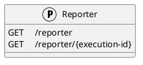
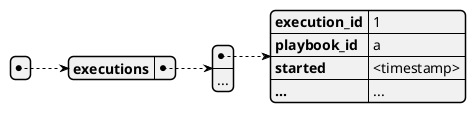

# Endpoint description

We will use HTTP status codes https://en.wikipedia.org/wiki/List_of_HTTP_status_codes





## /reporter
The reporter endpoint is used to fetch information about ongoing playbook executions in SOARCA

### GET `/reporter`
Get all execution IDs of currently ongoing executions.

#### Call payload
None

#### Response
200/OK with payload:


#### Error
400/BAD REQUEST with payload:
General error


### GET `/reporter/{execution-id}`
Get information about ongoing execution

#### Call payload
None

#### Response

Response data model:


|field              |content                |type               | description |
| ----------------- | --------------------- | ----------------- | ----------- |
|type               |"execution_status"     |string           |The type of this content
|id                 |UUID                   |string             |The id of the execution
|execution_id       |UUID                   |string             |The id of the execution
|playbook_id        |UUID                   |string             |The id of the CACAO playbook executed by the execution
|started            |timestamp              |string             |The time at which the execution of the playbook started
|ended              |timestamp              |string             |The time at which the execution of the playbook ended (if so)
|status             |execution-status-enum  |string             |The current [status](#execution-stataus) of the execution
|status_text        |explanation            |string             |A natural language explanation of the current status or related info
|error              |error                  |string     |Error raised along the execution of the playbook at execution level
|step_results       |step_results           |dictionary         |Map of step-id to related [step execution data](#step-execution-data)
|request_interval   |seconds                |integer            |Suggests the polling interval for the next request (default suggested is 5 seconds).


##### Step execution data
|field              |content                |type               | description |
| ----------------- | --------------------- | ----------------- | ----------- |
|step_id            |UUID                   |string             |The id of the step being executed
|started            |timestamp              |string             |The time at which the execution of the step started
|ended              |timestamp              |string             |The time at which the execution of the step ended (if so)
|status             |execution-status-enum  |string             |The current [status](#execution-stataus) of the execution of this step
|status_text        |explanation            |string             |A natural language explanation of the current status or related info
|error              |error                  |string             |Error raised along the execution of the step
|variables          |cacao variables        |dictionary         |Map of [cacao variables](https://docs.oasis-open.org/cacao/security-playbooks/v2.0/cs01/security-playbooks-v2.0-cs01.html#_Toc152256555) handled in the step (both in and out) with current values and definitions

##### Execution stataus 
Table from [Cyentific RNI workflow Status](https://github.com/cyentific-rni/workflow-status/blob/main/README.md#21-refined-execution-status-enumeration)
**Vocabulary Name:** `execution-status-enum`
| Property Name | Description|
| :--- | :--- |
| successfully_executed | The workflow step was executed successfully (completed). |
|failed| The workflow step failed. |
|ongoing| The workflow step is in progress. |
|server_side_error| A server-side error occurred. |
|client_side_error| A client-side error occurred.|
|timeout_error| A timeout error occurred. The timeout of a CACAO workflow step is specified in the “timeout” property. |
|exception_condition_error| A exception condition error ocurred. A CACAO playbook can incorporate an exception condition at the playbook level and, in particular, with the "workflow_exception" property. |


If the execution has completed and no further steps need to be executed

200/OK
with payload:

```plantuml
@startjson
[
    {
        "type" :        "execution-status",
        "id" :          "<execution-id>",
        "execution_id" : "<execution-id>",
        "playbook_id" :  "<playbook-id>",
        "started" :     "<time-string>",
        "ended" :       "<time-string>",
        "status" :      "<status-enum-value>",
        "status_text":  "<status description>",
        "errors" :      ["error1", "..."],
        "step_results" : {
            "<step-id-1>" : {
                "execution_id": "<execution-id>",
                "step_id" :     "<step-id>",
                "started" :     "<time-string>",
                "ended" :       "<time-string>",
                "status" :      "<status-enum-value>",
                "status_text":  "<status description>",
                "errors" :      ["error1", "..."],
                "variables":    {
                    "<variable-name-1>" : {
                        "type":         "<type>",
                        "name":         "<variable-name>",
                        "description":  "<description>",
                        "value":        "<value>",
                        "constant":     "<true/false>",
                        "external":     "<true/false>"
                    }
                }
            }
        },
        "request_interval" : "<n-seconds>"
    }
]
@endjson

The payload will include all information that the finished execution has created.


If the execution is still ongoing:

206/Partial Content
with payload equal to the 200 response, but impliclty not including all information from the execution, since the execution is still ongoing.

The step results object will list the steps that have been executed until the report request, and those that are being executed at the moment of the report request.

The "request_interval" suggests the polling interval for the next request (default suggested is 5 seconds).

#### Error
400/BAD REQUEST with payload:
General error

404/NOT FOUND
No execution with the specified ID was found.


