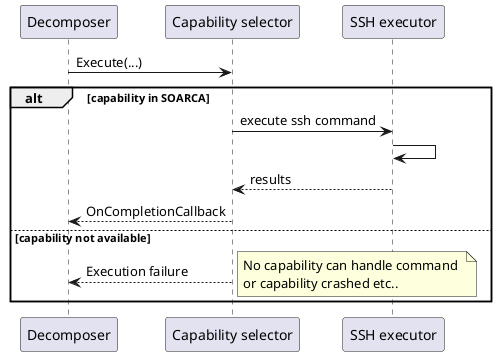

## Components
The executor consists of the following components. 

- Action executor
- Playbook action executor
- if-condition executor
- while-condition executor
- parallel executor

The decomposer interacts with every executor type. They all have separate interfaces to handle new step types in the future without changing the current interfaces.

```plantuml

package action{
    interface IExecutor {
        ..., err Execute(...)
    }
}

package playbookaction{
    interface IExecutor {
        ..., err Execute(...)
    }
}

package ifcondition{
    interface IExecutor {
        ..., err Execute(...)
    }
}

package whilecondition{
    interface IExecutor {
        ..., err Execute(...)
    }
}

package parallel{
    interface IExecutor {
        ..., err Execute(...)
    }
}


interface ICapability{
    variables, error Execute(Metadata, command, variable[], target, agent)
    string GetModuleName()
}

class "Decomposer" as decomposer
class "Action Executor" as Executor 
class "Playbook Executor" as playbook
class "Parallel Executor" as parallelexecutor
class "While Executor" as while
class "If condition Executor" as condition

class "Ssh" as ssh
class "OpenC2" as openc2
class "HttpApi" as api
class "CalderaCmd" as calderacmd
class "Fin" as fin


action.IExecutor <|.. Executor
ICapability <-up- Executor
ICapability <|.. ssh
ICapability <|.. openc2
ICapability <|.. api
ICapability <|.. fin

playbookaction.IExecutor <|.. playbook
ifcondition.IExecutor <|.. condition
whilecondition.IExecutor <|.. while
parallel.IExecutor <|.. parallelexecutor

decomposer -down-> playbookaction.IExecutor
decomposer -down-> ifcondition.IExecutor
decomposer -down-> whilecondition.IExecutor
decomposer -down-> parallel.IExecutor
decomposer -down-> action.IExecutor


```

### Action executor

The action executor consist of the following components

- The capability selector
- Native capabilities (command executors)
- MQTT capability to interact with: Fin capabilities (third-party executors)

The capability selector will select the implementation which is capable of executing the incoming command. There are native capabilities based on the CACAO `command-type-ov`:

* **Currently implemented**
    * ssh
    * http-api
    * openc2-http
    * powershell
* **Coming soon**
    * caldera-cmd
    * manual
* **Future (potentially)**
    * bash
    * elastic
    * jupyter
    * kestrel
    * sigma
    * yara

#### Native capabilities
The executor will select a module that is capable of executing the command and pass the details to it. The capability selection is performed based on the agent type (see [Agent and Target Common Properties](https://docs.oasis-open.org/cacao/security-playbooks/v2.0/cs01/security-playbooks-v2.0-cs01.html#_Toc152256509) in the CACAO 2.0 spec). The convention is that the agent type must equal `soarca-<capability identifier>`, e.g. `soarca-ssh` or `soarca-openc2-http`.

The result of the step execution will be returned to the decomposer. A result can be either output variables or error status.

#### MQTT executor -> Fin capabilities
The Executor will put the command on the MQTT topic that is offered by the module. How a module handles this is described in the link:modules.adoc[module documentation]

#### Component overview

```plantuml

package "Controller" {
component Decomposer as parser

}
package "Executor" {
    component SSH as exe2
    component "HTTP-API" as exe1
    component MQTT as exe3
}

package "Fins" {
    component "VirusTotal" as virustotal
    component "E-mail Sender" as email
}

parser -- Executor
exe3 -- Fins : " MQTT topics"
```

#### Sequences 

Example execution for SSH commands with SOARCA native capability. 




### Playbook action executor
The playbook executor handles execution of playbook action steps. The variables from the top level playbook are injected into the be executed playbook. 
It could happen that in the downstream playbook the variables `collide` with the top level playbook. In this case the top level playbook variables are `NOT` transferred to the downstream playbook. `Agents and Targets cannot be transferred` between playbooks at this time. Playbooks are only loaded in the executor and then a new Decomposer is created to execute the playbook. 

The result of the step execution will be returned to the decomposer. A result can be either output variables or error status.

```plantuml
package playbookaction{
    interface IExecutor {
        Variables, err Execute(meta, step, variables)
    }
}
class "Decomposer" as decomposer
class "Action Executor" as exe 
interface "IPlaybookController" as controller
interface "IDatabaseController" as database
  
playbookaction.IExecutor <|.. exe
decomposer -> playbookaction.IExecutor
exe -> controller
database <- exe

```

### If condition executor
The if-condition executor will process a cacao if-condition step and determine it's output. 

The result of the step comparison will be returned to the decomposer. A result can be either a next step id and/or error status. 

### While condition executor 
The if-condition executor will process a cacao while-condition step and determine it's output. 

The result of the step comparison will be returned to the decomposer. A result can be either a next step id and/or error status. Only STIX comparison expressions are implemented at this time. 

{}
Note only [Comparison Expression](http://docs.oasis-open.org/cti/stix/v2.0/cs01/part5-stix-patterning/stix-v2.0-cs01-part5-stix-patterning.html#_Toc496717749) are implemented for all CACAO variable types.
{}

### Parallel step executor
The parallel executor will execute the parallel step. This will be done in sequence to simplify implementation. As parallel steps must not depend on each other, sequential execution is possible. Later this will be changed.
