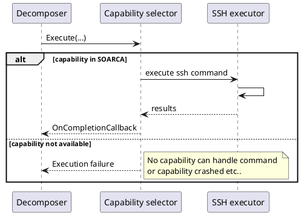

## Components

The executer consists of the following components. 

- The capability selector
- Native capabilities (command executors)
- MQTT capability to interact with: Fin capabilities (third party executors)

### Capability selector (Executor)

The capability selector will select the implementation which is capable of executing the incoming command. There are native capabilities which are based on the CACAO `command-type-ov`:

* **Currently implemented**
    * ssh
    * http-api
    * openc2-http
* **Coming soon**
    * manual
* **Future (potentially)**
    * bash
    * caldera-cmd
    * elastic
    * jupyter
    * kestrel
    * sigma
    * yara

### Native capabilities
The Executor will select a module which is capable of execution the command and pass the detail to it. The capability selection is performed on the basis of the agent-type (see [Agent and Target Common Properties](https://docs.oasis-open.org/cacao/security-playbooks/v2.0/cs01/security-playbooks-v2.0-cs01.html#_Toc152256509) in the CACAO 2.0 spec). The convention is that the agent type must equal `soarca-<capability identifier>`, e.g. `soarca-ssh` or `soarca-openc2-http`.

The result of the step execution will be returned to the decomposer. Result can be output variables or error status.

### MQTT executor -> Fin capabilities
The Executor will put the command on the MQTT topic that is offered by the module. How a module handles this is described in the link:modules.adoc[module documentation]

### Component overview

```plantuml

package "Controller" {
component Decomposer as parser

}
package "Executor" {
    component SSH as exe2
    component "HTTP-API" as exe1
    component MQTT as exe3
}

package "Fins" {
    component "VirusTotal" as virustotal
    component "E-mail Sender" as email
}

parser -- Executor
exe3 -- Fins : " MQTT topics"
```


## Executor classes


```plantuml

interface IExecutor {
    void Execute(ExecutionId, CommandData, variable[], target, module, completionCallback(variables[]))
    void Pause(CommandData, module)
    void Resume(CommandData, module)
    void Kill(CommandData, module)
}

struct State{
    stopped
    running
    paused
}


interface ICapability{
    void Execute(ExecutionId, CommandData, variable[], target, completionCallback(variables[]))
    module GetModuleName()
}


class Executor 

class "Ssh" as ssh
class "OpenC2" as openc2
class "HttpApi" as api


IExecutor <|.. Executor
Executor -> ICapability
ICapability <|.. ssh
ICapability <|.. openc2
ICapability <|.. api

```


## Sequences 

Example execution for SSH commands with SOARCA native capability. 




