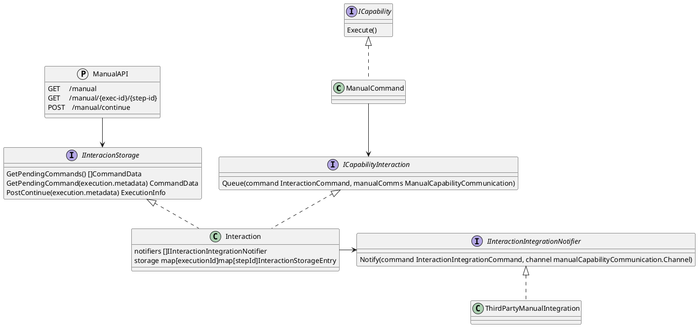
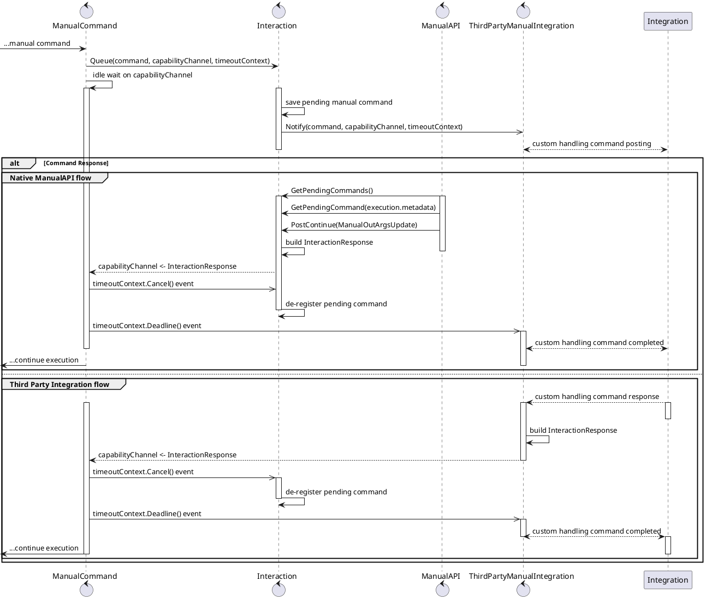
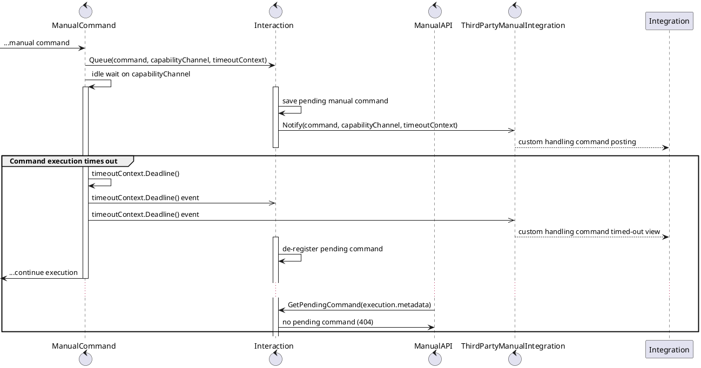

Executor modules are part of the SOARCA core. Executor modules perform the actual commands in CACAO playbook steps.

## Native modules in SOARCA
The following capability modules are currently defined in SOARCA:
 
- ssh
- http-api
- openc2-http
- powershell
- caldera-cmd
- manual

The capability will be selected based on the agent in the CACAO playbook step. The agent should be of type `soarca` and have a name corresponding to `soarca-[capability name]`. 

### SSH capability

This capability executes [SSH Commands](https://docs.oasis-open.org/cacao/security-playbooks/v2.0/cs01/security-playbooks-v2.0-cs01.html#_Toc152256500) on the specified targets.

This capability support [User Authentication](https://docs.oasis-open.org/cacao/security-playbooks/v2.0/cs01/security-playbooks-v2.0-cs01.html#_Toc152256508) using the `user-auth` type. For SSH authentication username/password is authentication supported.

#### Success and failure

The SSH step is considered successful if a proper connection to each target can be initialized, the supplied command executes without error, and returns with zero exit status.

In every other circumstance the step is considered to have failed.

#### Variables

This module does not define specific variables as input, but variable interpolation is supported in the command and target definitions. It has the following output variables:

```json
{
    "__soarca_ssh_result__": {
        "type": "string",
        "value": "<stdout of the last command>"
    }
}
```

#### Example

```json
{
    "workflow": {
        "action--7777c6b6-e275-434e-9e0b-d68f72e691c1": {
            "type": "action",
            "agent": "soarca--00010001-1000-1000-a000-000100010001",
            "targets": ["linux--c7e6af1b-9e5a-4055-adeb-26b97e1c4db7"],
            "commands": [
                {
                    "type": "ssh",
                    "command": "ls -la"
                }
            ]
        }
    },
    "agent_definitions": {
        "soarca--00010001-1000-1000-a000-000100010001": {
            "type": "soarca",
            "name": "soarca-ssh"
        }
    },
    "target_definitions": {
        "linux--c7e6af1b-9e5a-4055-adeb-26b97e1c4db7": {
            "type": "linux",
            "name": "target",
            "address": { "ipv4": ["10.0.0.1"] }
        }
    }
}
```


### HTTP-API capability

This capability implements the [HTTP API Command](https://docs.oasis-open.org/cacao/security-playbooks/v2.0/cs01/security-playbooks-v2.0-cs01.html#_Toc152256495).

Both [HTTP Basic Authentication](https://docs.oasis-open.org/cacao/security-playbooks/v2.0/cs01/security-playbooks-v2.0-cs01.html#_Toc152256506) with user_id/password and token based [OAuth2 Authentication](https://docs.oasis-open.org/cacao/security-playbooks/v2.0/cs01/security-playbooks-v2.0-cs01.html#_Toc152256507) are supported.

At this time, redirects are not supported.

#### Success and failure

The command is considered to have successfully completed if a successful HTTP response is returned from each target. An HTTP response is successful if it's response code is in the range 200-299.

#### Variables

This capability supports variable interpolation in the command, port, authentication info, and target definitions.

The result of the step is stored in the following output variables:

```json
{
    "__soarca_http_api_result__": {
        "type": "string",
        "value": "<http response body>"
    }
}
```

#### Example

```json
{
    "workflow": {
        "action--8baa7c78-751b-4de9-81d4-775806cee0fb": {
            "type": "action",
            "agent": "soarca--00020001-1000-1000-a000-000100010001",
            "targets": ["http-api--4ebae9c3-9454-4e28-b25b-0f43cd97f9e0"],
            "commands": [
                {
                    "type": "http-api",
                    "command": "GET /overview HTTP/1.1",
                    "port": "8080"
                }
            ]
        }
    },
    "agent_definitions": {
        "soarca--00020001-1000-1000-a000-000100010001": {
            "type": "soarca",
            "name": "soarca-http-api"
        }
    },
    "target_definitions": {
        "http-api--4ebae9c3-9454-4e28-b25b-0f43cd97f9e0": {
            "type": "http-api",
            "name": "target",
            "address": { "dname": ["my.server.com"] }
        }
    }
}
```

### OpenC2 capability

This capability implements the [OpenC2 HTTP Command](https://docs.oasis-open.org/cacao/security-playbooks/v2.0/cs01/security-playbooks-v2.0-cs01.html#_Toc152256498), by sending [OpenC2 messages](https://docs.oasis-open.org/openc2/oc2ls/v1.0/cs01/oc2ls-v1.0-cs01.html)  using the [HTTPS transport method](https://docs.oasis-open.org/openc2/open-impl-https/v1.0/open-impl-https-v1.0.html).

It supports the same authentication mechanisms as the HTTP-API capability.

#### Success and failure

Any successful HTTP response from an OpenC2 compliant endpoint (with a status code in the range 200-299) is considered a success. Connection failures and HTTP responses outside the 200-299 range are considered a failure.

#### Variables

It supports variable interpolation in the command, headers, and target definitions.

The result of the step is stored in the following output variables:

```json
{
    "__soarca_openc2_http_result__": {
        "type": "string",
        "value": "<openc2-http response body>"
    }
}
```

#### Example

```json
{
    "workflow": {
        "action--aa1470d8-57cc-4164-ae07-05745bef24f4": {
            "type": "action",
            "agent": "soarca--00030001-1000-1000-a000-000100010001",
            "targets": ["http-api--5a274b6d-dc65-41f7-987e-9717a7941876"],
            "commands": [{
                "type": "openc2-http",
                "command": "POST /openc2-api/ HTTP/1.1",
                "content_b64": "ewogICJoZWFkZXJzIjogewogICAgInJlcXVlc3RfaWQiOiAiZDFhYzA0ODktZWQ1MS00MzQ1LTkxNzUtZjMwNzhmMzBhZmU1IiwKICAgICJjcmVhdGVkIjogMTU0NTI1NzcwMDAwMCwKICAgICJmcm9tIjogInNvYXJjYS5ydW5uZXIubmV0IiwKICAgICJ0byI6IFsKICAgICAgImZpcmV3YWxsLmFwaS5jb20iCiAgICBdCiAgfSwKICAiYm9keSI6IHsKICAgICJvcGVuYzIiOiB7CiAgICAgICJyZXF1ZXN0IjogewogICAgICAgICJhY3Rpb24iOiAiZGVueSIsCiAgICAgICAgInRhcmdldCI6IHsKICAgICAgICAgICJmaWxlIjogewogICAgICAgICAgICAiaGFzaGVzIjogewogICAgICAgICAgICAgICJzaGEyNTYiOiAiMjJmZTcyYTM0ZjAwNmVhNjdkMjZiYjcwMDRlMmI2OTQxYjVjMzk1M2Q0M2FlN2VjMjRkNDFiMWE5MjhhNjk3MyIKICAgICAgICAgICAgfQogICAgICAgICAgfQogICAgICAgIH0KICAgICAgfQogICAgfQogIH0KfQ==",
                "headers": {
                    "Content-Type": ["application/openc2+json;version=1.0"]
                }
            }]
        }
    },
    "agent_definitions": {
        "soarca--00030001-1000-1000-a000-000100010001": {
            "type": "soarca",
            "name": "soarca-openc2-http"
        }
    },
    "target_definitions": {
        "http-api--5a274b6d-dc65-41f7-987e-9717a7941876": {
            "type": "http-api",
            "name": "openc2-compliant actuator",
            "address": { "ipv4": ["187.0.2.12"] }
        }
    }
}
```


### PowerShell capability

This capability implements the [PowerShell Command](https://docs.oasis-open.org/cacao/security-playbooks/v2.0/cs01/security-playbooks-v2.0-cs01.html#_Toc152256499), by sending [PowerShell commands](https://learn.microsoft.com/en-us/powershell/scripting/overview?view=powershell-7.4) using the [WinRM transport method](https://learn.microsoft.com/en-us/windows/win32/winrm/portal).

It supports the username, password authentication mechanism.

#### Success and failure

Any successful command will have a `__soarca_powershell_result__`. If an error occurs on the target a `__soarca_powershell_error__` populated will be returned and Error will be set.

#### Variables

It supports variable interpolation in the command, headers, and target definitions.

The result of the step is stored in the following output variables:

```json
{
    "__soarca_powershell_result__": {
        "type": "string",
        "value": "<raw powershell output>"
    }, 
    "__soarca_powershell_error__": {
        "type": "string",
        "value": "<raw powershell error output>"
    },
}
```

#### Example

```json
{
    "workflow": {
        "action--aa1470d8-57cc-4164-ae07-05745bef24f4": {
            "type": "action",
            "agent": "soarca--00040001-1000-1000-a000-000100010001",
            "targets": ["net-address--d42d6731-791d-41af-8fa4-7b5699dfe402"],
            "commands": [{
                "type": "powershell",
                "command": "pwd"
            }]
        }
    },
    "agent_definitions": {
        "soarca--00040001-1000-1000-a000-000100010001": {
            "type": "soarca",
            "name": "soarca-powershell"
        }
    },
    "target_definitions": {
        "net-address--d42d6731-791d-41af-8fa4-7b5699dfe402": {
            "type": "net-address",
            "name": "Windows Server or Client with WinRM enabled",
            "address": { "ipv4": ["187.0.2.12"] }
        }
    }
}
```

### Caldera capability

This capability executes [Caldera Abilities](https://caldera.readthedocs.io/en/latest/Learning-the-terminology.html#abilities-and-adversaries) on the specified targets by creating an operation on a separate Caldera server. 
The server is packaged in the docker build of SOARCA, but can also be provided separably as a stand-alone server.

#### Success and failure

The Caldera step is considered successful if a connection to the Caldera server can be established, the ability, if supplied as b64command, can be created on the server, an operation can be started on the specified group and adversary, and the operation finished without errors.

In every other circumstance the step is considered to have failed.

#### Variables

This module does not define specific variables as input, but variable interpolation is supported in the command and target definitions. It has the following output variables:

```json
{
    "__soarca_caldera_cmd_result__": {
        "type": "string",
        "value": ""
    }
}
```

#### Example

This example will start an operation that executes the ability with ID `36eecb80-ede3-442b-8774-956e906aff02` on the Caldera agent group `infiltrators`.
```json
{
    "workflow": {
        "action--7777c6b6-e275-434e-9e0b-d68f72e691c1": {
            "type": "action",
            "agent": "soarca--00050001-1000-1000-a000-000100010001",
            "targets": ["security-category--c7e6af1b-9e5a-4055-adeb-26b97e1c4db7"],
            "commands": [
                {
                    "type": "caldera",
                    "command": "36eecb80-ede3-442b-8774-956e906aff02"
                }
            ]
        }
    },
    "agent_definitions": {
        "soarca--00050001-1000-1000-a000-000100010001": {
            "type": "soarca",
            "name": "soarca-caldera-cmd"
        }
    },
    "target_definitions": {
        "linux--c7e6af1b-9e5a-4055-adeb-26b97e1c4db7": {
            "type": "security-category",
            "name": "infiltrators"
            "category": ["caldera"],
        }
    }
}
```

### Manual capability 
This capability executes [manual Commands](https://docs.oasis-open.org/cacao/security-playbooks/v2.0/cs01/security-playbooks-v2.0-cs01.html#_Toc152256491) and provides them natively through the [SOARCA api](/docs/core-components/api-manual), though other integrations are possible.


The manual capability will allow an operator to interact with a playbook. It could allow one to perform a manual step that could not be automated, enter a variable to the playbook execution or a combination of these operations.

The manual step should provide a timeout. SOARCA will by default use a timeout of 10 minutes. If a timeout occurs, the step is considered as failed.

#### Manual capability architecture

In essence, executing a manual command involves the following actions:
1. A message, the `command` of a manual command, is posted *somewhere*, *somehow*, together with the variables of which values is expected to be assigned or updated (if any).
2. The playbook execution stops, waiting for *something* to respond to the message with the variables values.
3. Once something replies, the variables are streamed inside the playbook execution and handled accordingly.

It should be possible to post a manual command message anywhere and in any way, and allow anything to respond back. Hence, SOARCA adopts a flexible architecture to accomodate different ways of manual *interactions*. Below a view of the architecture.

When a playbook execution hits an Action step with a manual command, the *ManualCapability* will queue the instruction into the *CapabilityInteraction* module. The module does essentially three things: 
1. it stores the status of the manual command, and implements the SOARCA API interactions with the manual command.
2. If manual integrations are defined for the SOARCA instance, the *CapabilityInteraction* module notifies the manual integration modules, so that they can handle the manual command in turn.
3. It waits for the manual command to be satisfied either via SOARCA APIs, or via manual integrations. The first to respond amongst the two, resolves the manual command. The resolution of the command may or may not assign new values to variables in the playbook. Finally the *CapabilityInteraction* module replies to the *ManualCommand* module.

Ultimately the *ManualCapability* then completes its execution, having eventually updated the values for the variables in the outArgs of the command. Timeouts or errors are handled opportunely.



The default and internally-supported way to interact with the manual step is through SOARCA's [manual api](/docs/core-components/api-manual). 
Besides SOARCA's [manual api](/docs/core-components/api-manual), SOARCA is designed to allow for configuration of additional ways that a manual command should be executed. In particular, there can be *one* manual integration (besides the native manual APIs) per running SOARCA instance.
Integration's code should implement the *IInteractionIntegrationNotifier* interface, returning the result of the manual command execution in form of an `InteractionIntegrationResponse` object, into the respective channel.

The diagram below displays in some detail the way the manual interactions components work.



Note that whoever resolves the manual command first, whether via the manualAPI, or a third party integration, then the command results are returned to the workflow execution, and the manual command is removed from the pending list. Hence, if a manual command is resolved e.g. via the manual integration, a postContinue API call for that same command will not go through, as the command will have been resolved already, and hence removed from the registry of pending manual commands.

The diagram below shows instead what happens when a timeout occurs for the manual command.



#### Success and failure

In SOARCA the manual step is considered successful if a response is made through the [manual api](/docs/core-components/api-manual), or an integration. The manual command can specify a timeout, but if none is specified SOARCA will use a default timeout of 10 minutes. If a timeout occurs the step is considered as failed and SOARCA will return an error to the decomposer.

#### Variables

This module does not define specific variables as input, but it requires one to use out_args if an operator want to provide a response to be used later in the playbook.

#### Example

```json
{
    "workflow": {
        "action--7777c6b6-e275-434e-9e0b-d68f72e691c1": {
            "type": "action",
            "agent": "soarca--00010001-1000-1000-a000-000100010001",
            "targets": ["linux--c7e6af1b-9e5a-4055-adeb-26b97e1c4db7"],
            "commands": [
                {
                    "type": "manual",
                    "command": "Reset the firewall by unplugging it"
                }
            ]
        }
    },
    "agent_definitions": {
        "soarca--00040001-1000-1000-a000-000100010001": {
            "type": "soarca",
            "name": "soarca-manual"
        }
    },
    "target_definitions": {
        "linux--c7e6af1b-9e5a-4055-adeb-26b97e1c4db7": {
            "type": "linux",
            "name": "target",
            "address": { "ipv4": ["10.0.0.1"] }
        }
    }
}
```
---

## MQTT fin module
This module is used by SOARCA to communicate with fins (capabilities) see [fin documentation](/docs/soarca-extensions/) for more information
