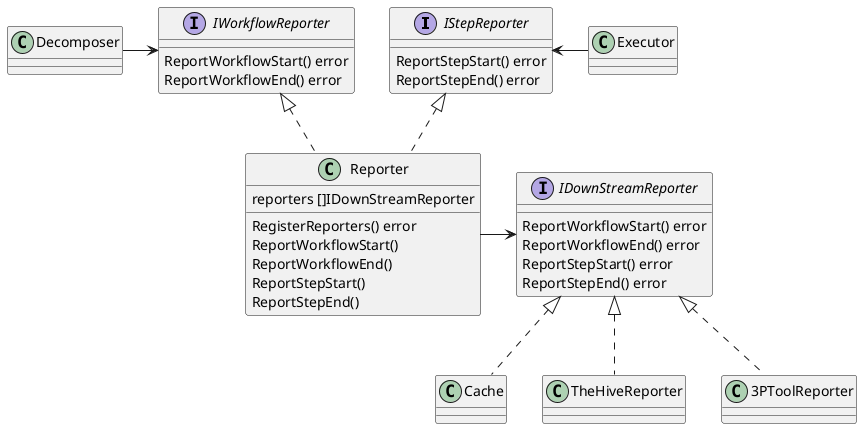
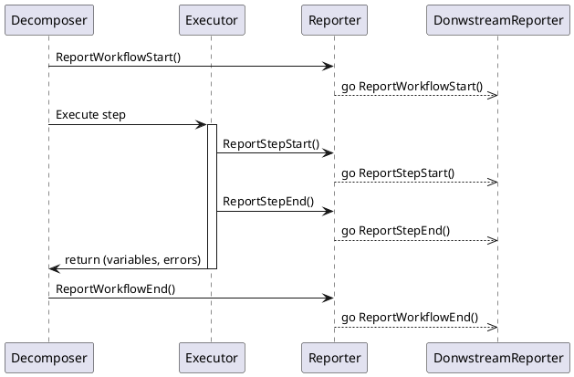
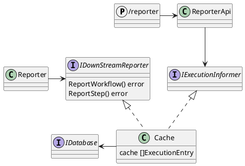
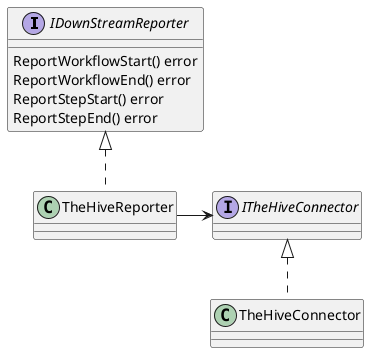

SOARCA utilizes push-based reporting to provide information on the instantiation of a CACAO workflow, and information on the execution of workflow steps.

## General Reporting Architecture

For the execution of a playbook, a *Decomposer* and invoked *Executor*s are injected with a *Reporter*. The *Reporter* maintains the reporting logic that reports execution information to a set of specified and available reporting targets.

A reporting target can be internal to SOARCA, such as a [Cache](#cache-reporter). A reporting target can also be a third-party tool, such as an external SOAR/ SIEM, or incident case management system (see [connectors](#connectors-and-3p-tools-reporting)).

Upon execution trigger for a playbook, information about the chain of playbook steps to be executed will be pushed to the targets via dedicated reporting classes.

Along the execution of the workflow steps, the reporting classes will dynamically update the steps execution information such as output variables, and step execution success or failure.

The reporting modules enables the population and updating of views and data concerning workflow composition and its dynamic execution results. This data can be transmitted to SOARCA internal reporting components such as a cache, as well as to third-party tools (see [connectors](#connectors-and-3p-tools-reporting)).

The schema below represents the architecture concept.

### Reporting is Asynchronous
Reporting functionalities are triggered asynchronously by means of go routines, such that reporting logic does not affect the execution timings of the CACAO playbooks. Note that this also implies that there might be small inconsistencies between the actual status of an execution, and what can be found in the reporting. For instance, reporting on the status of a step N, might take longer than reporting on the status of step N+1. Typically, the actual playbook execution may be slightly ahead of the reporting - and generally within a seconds-wide window. Execution timings, though, are always reported correctly, since we generated them within the workflow execution itself, and not within the reporting module.

The flow diagram below highlights the asynchronous mechanisms of reporting.

Note that the main reporter module is invoked synchronously. In turn, the main reporter module calls all downstream reporters, which implement the actual reporting logic, asynchronously. Also note any eventual reporting error never stops an execution, and only logs a warning.

### Interfaces

The reporting logic and extensibility is implemented in the SOARCA architecture by means of reporting interfaces. At this stage, we implement an *IWorkflowReporter* to push information about the entire workflow to be executed, and an *IStepReporter* to push step-specific information as the steps of the workflow are executed.

A high level *Reporter* component will implement both interfaces, and maintain the list of *DownStreamRepporter*s activated for the SOARCA instance. The *Reporter* class will invoke all reporting functions for each active reporter. The *Executer* and *Decomposer* components will be injected each with the Reporter though, as interface of respectively workflow reporter, and step reporter, to keep the reporting scope separated.

The *DownStream* reporters will implement push-based reporting functions specific for the reporting target, as shown in the *IDownStreamReporter* interface. Internal components to SOARCA, and third-party tool reporters, will thus implement the *IDownStreamReporter* interface.

## Native Reporters

SOARCA implements internally reporting modules to handle database and caches reporting.

### Cache reporter

The *Cache* reporter mediates between [decomposer](https://cossas.github.io/SOARCA/docs/core-components/decomposer/) and [executors](https://cossas.github.io/SOARCA/docs/core-components/executer/), [database](https://cossas.github.io/SOARCA/docs/core-components/database/), and reporting APIs. As *DownStreamReporter*, the *Cache* stores workflow and step reports in-memory for an ongoing execution. As *IExecutionInformant*, the *Cache* provides information to the reporting API. The schema below shows how it is positioned in the SOARCA architecture.

The *Cache* thus reports the execution information downstream both in the database, and in memory. Upon execution information requests from the `/reporter` API, the cache can provide information fetching either from memory, or querying the database.

## Connectors and 3P tools reporting

Reporting towards a 3rd Party tool is implemented in SOARCA by means of two components. 
1. a 3PTool *DownStreamReporter* that organizes the execution information according to the data formats of the 3rd Party tool, and
2. a *Connector* module that receives data in 3PTool-specific formats, and handles the connectivity calls towards the 3P tool

At the current stage, the following 3rd Party tool *DownStreamReporter*s and *Connector*s will be implemented in SOARCA.

### TheHive
The *TheHiveReporter* reports on the execution of a playbook to an instance of [The Hive](https://strangebee.com/thehive/) platform. In order to be used, The Hive's address and api key need to be configured in the environment variables of the SOARCA instance, either in the .env file for a source-code-built SOARCA instance, or in the SOARCA `docker-compose` for Docker builds. SOARCA will negotiate the authorization with the The Hive instance upon SOARCA initialization.

The *TheHiveConnector* receives execution information from the *TheHiveReporter*, and performs the actual network calls to report such infromation to the The Hive instance.

## Future plans

At this stage, third-party tools integrations may be built in SOARCA via packages implementing reporting logic for the specific tools. Alternatively, third-party tools may implement pull-based mechanisms (via the API) to get information from the execution of a playbook via SOARCA.

In the near future, we will (also) make available a SOARCA Report API that can establish a WebSocket connection to a third-party tool. As such, this will thus allow SOARCA to push execution updates as they come to third-party tools, without external tools having to poll SOARCA.

Furthermore, we will define more *Connector* donwstream reporters which will implement workflow execution reporting for specific platforms and products. 
