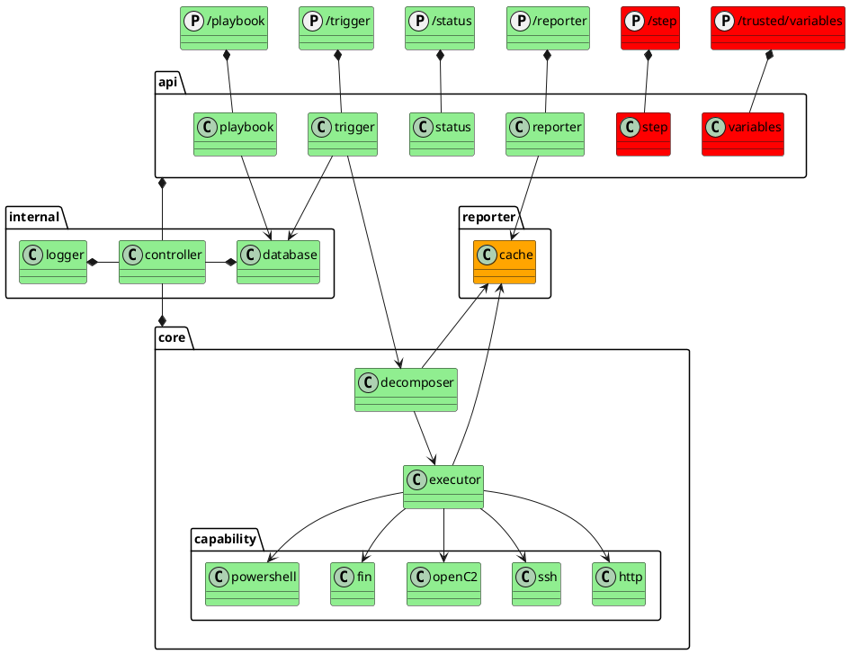

##  Design decisions and core dependencies
To allow for fast execution and type-safe development SOARCA is developed in `go`. The application application can be deployed in `Docker`. Further dependencies are `MQTT` for the module system and `go-gin` for the REST API.


The overview on this page is aimed to guide you through the SOARCA architecture and components as well as the main flow. 

## Components

Components of SOARCA are displayed in the component diagram. 
- Green is implemented 
- Orange has limited functionality
- Red is not started but will be added in future releases



## Classes

This diagram consists of the class structure used by SOARCA


### Controller
The SOARCA controller will create all classed needed by SOARCA. The controller glues the api and decomposer together. Each run will instantiate a new decomposer. 

```plantuml
interface IPlaybook{
    void Get()
    void Get(PlaybookId id)
    void Add(Playbook playbook)
    void Update(Playbook playbook)
    void Remove(Playbook playbook)
}

interface IStatus{

}

interface ITrigger{
    void TriggerById(PlaybookId id)
    void Trigger(Playbook playbook)
}

Interface IPlaybookDatabase

Interface IDecomposer
Interface IExecuter

class Trigger
class Controller
class Decomposer

IPlaybook <|.. Playbook
ITrigger <|.. Trigger
IStatus <|.. Status


Trigger -> IPlaybookDatabase
IPlaybookDatabase <- Playbook
IPlaybookDatabase <|.. PlaybookDatabase


IDecomposer <- Trigger
IDecomposer <|.. Decomposer
IExecuter -> Decomposer

```


## Main application flow
These sequences will show a simplified overview of how the SOARCA components interact.

The main flow of the application is the following. Execution will start by processing the JSON formatted CACAO playbook if successful the playbook is handed over to the Decomposer. This is where the playbook is decomposed into its parts and passed step by step to the executor. These operations will block the API until execution is finished. For now, no variables are exposed via the API to the caller.

```plantuml
Actor Caller
Caller -> Api
Api -> Trigger : /trigger
Trigger -> Decomposer : Trigger playbook as ad-hoc execution
loop for each step 
Decomposer -> Executor : Send step to executor
Executor -> Executor : select capability (ssh selected)
Executor -> Ssh : Command
Executor <-- Ssh : return
Decomposer <-- Executor
else execution failure (break loop)
Executor <-- Ssh : error
Decomposer <-- Executor: error
Decomposer -> Decomposer : stop execution

end 
Trigger <-- Decomposer : execution details
Api <-- Trigger : execution details
Caller <-- Api
```