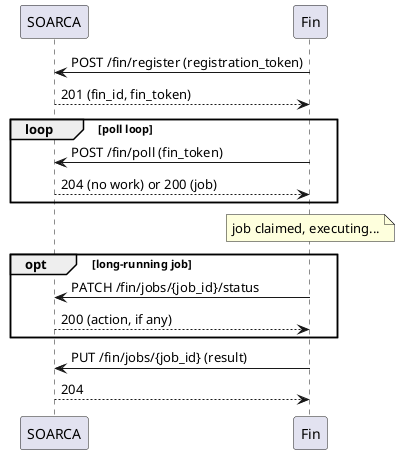

## Goals

The goal of the protocol is to provide a simple and robust way to
communicate between the SOARCA orchestrator and the capabilities (Fins)
that can provide extra functions. Fins are external, independently-deployed
processes: they register once with SOARCA, then repeatedly poll for work,
execute it, and report the result back. All calls are outbound from the
Fin — no inbound connectivity, firewall holes, or message broker are
required on the Fin side.

{}
This replaces the previous MQTT-based Fin protocol. There is no migration
path: any existing MQTT-based Fin implementation is not compatible with
this protocol.
{}

## Transport and authentication

The protocol is plain HTTP(S) + JSON. There is no separate framing or
message-envelope layer — each protocol "message" from the previous MQTT
design is now just the body of a regular HTTP request/response.

Three separate credentials/schemes are involved, each scoped to a different
purpose:

| Credential | Used for | Sent as |
| ---------- | -------- | ------- |
| `FIN_REGISTRATION_TOKEN` | one-time, gating `POST /fin/register` | `registration_token` field in the request body |
| `fin_token` | every other Fin-initiated call (poll/result/status/unregister) | `Authorization: Bearer <fin_token>` header |
| SOARCA admin JWT | the read-only discovery endpoints (`GET /fin/`, `GET /fin/{fin_id}`) | `Authorization: Bearer <jwt>` header, same as the rest of the admin API |

`FIN_REGISTRATION_TOKEN` is a coarse, instance-level shared secret
configured server-side and distributed to Fin operators out-of-band. If it
is not configured (empty), registration is disabled entirely — SOARCA fails
closed rather than silently accepting any registration attempt.

`fin_token` is returned once, at registration (see below), and is expected
to be persisted locally by the Fin (e.g. in a local config file) so a
restarted Fin process can start polling again immediately, without
re-registering. SOARCA never stores the plaintext token — only a one-way
hash of it — so a database read or leak alone cannot recover a usable
credential.

Fin registrations are itself persisted (database-backed, mirroring how
playbooks are persisted): SOARCA does not need Fins to re-register every
time it restarts or is updated. The in-memory job queue, by contrast, is
*not* persisted — SOARCA does not persist or resume in-flight executions
across a restart either, so persisting only the job queue would add
complexity for no real gain (see
[EXECUTION-MODEL.md](https://github.com/COSSAS/SOARCA/blob/main/docs/adr/EXECUTION-MODEL.md)).
A restart loses in-flight jobs the same way it loses everything else about
an in-flight execution — any Fin still holding a claimed job simply has its
next status ping/result submission rejected, and the step fails once its
own timeout elapses.

## Endpoints

| Method | Path | Auth | Purpose |
| ------ | ---- | ---- | ------- |
| `POST` | `/fin/register` | registration token | Register a new Fin identity and obtain a `fin_token` |
| `POST` | `/fin/poll` | fin_token | Long-poll for the next job matching this Fin's registered capability types |
| `PUT` | `/fin/jobs/{job_id}` | fin_token | Submit the result of a claimed job |
| `PATCH` | `/fin/jobs/{job_id}/status` | fin_token | Extend a claimed job's lease and check for a pending instruction (e.g. cancellation) |
| `DELETE` | `/fin/` | fin_token | Unregister the calling Fin itself - the fin_id is inferred from the token, never sent explicitly |
| `GET` | `/fin/` | admin JWT | List all currently-registered Fins and their capabilities |
| `GET` | `/fin/{fin_id}` | admin JWT | Look up a specific registered Fin by id |
| `DELETE` | `/fin/{fin_id}` | admin JWT | Forcibly remove any Fin's registration (e.g. one that is stale/offline and will never unregister itself) |

The full request/response bodies are documented in the generated
[OpenAPI/Swagger reference](/docs/soarca-api/), under the `fin` tag.

### Registering a Fin

A Fin process declares one or more **capabilities** at registration time —
each capability has a `type` (the routing key playbook authors write into
`agent_definitions[...].type`), plus optional `description`, `version`, and
illustrative `step_examples` (full CACAO action steps, shown to playbook
authors to demonstrate how to invoke the capability — never interpreted or
validated by SOARCA itself).

Multiple, independently-deployed Fin processes may register the same
capability `type`. SOARCA treats them as one interchangeable pool: any of
them may claim a job queued under that type, competing via long-poll
(load-balancing and failover across a pool is "whichever Fin happens to be
idle and polling", with no separate leader-election or assignment logic).

```json
POST /fin/register
{
    "registration_token": "<shared secret>",
    "display_name": "example-ssh-fin",
    "protocol_version": "1.0.0",
    "capabilities": [
        {
            "type": "custom-ssh-fin",
            "description": "SSH command execution",
            "version": "0.1.0",
            "step_examples": [
                {
                    "type": "action",
                    "name": "Restart the nginx service",
                    "agent": "custom-ssh-fin--f3f0194f-99e6-4966-8512-de3806fecfdf",
                    "commands": [
                        {
                            "type": "manual",
                            "command": "sudo systemctl restart nginx"
                        }
                    ]
                }
            ]
        }
    ]
}
```

```json
201 Created
{
    "fin_id": "<server-assigned uuid>",
    "fin_token": "<one-time credential, persist this>",
    "poll_interval_seconds": 5,
    "long_poll_timeout_seconds": 25,
    "job_lease_seconds": 60
}
```

`poll_interval_seconds`/`long_poll_timeout_seconds`/`job_lease_seconds` are
server-chosen operational defaults, echoed back so a Fin implementation
doesn't need its own hardcoded copy of them.

### Polling for work

A Fin repeatedly calls `POST /fin/poll`, authenticated with its
`fin_token`. SOARCA long-polls the request: it holds the connection open
until a job matching one of the Fin's registered capability types becomes
available, or `long_poll_timeout_seconds` elapses — whichever comes first.
An empty body plus `204 No Content` means "no work right now, just poll
again"; this is the expected, common case, not an error.

```json
POST /fin/poll
{
    "concurrency_available": 1
}
```

```json
200 OK
{
    "job": {
        "job_id": "<uuid>",
        "execution_id": "<uuid>",
        "playbook_id": "playbook--...",
        "step_id": "action--...",
        "step_execution_id": "<uuid>",
        "capability_type": "custom-ssh-fin",
        "lease_expires_in_seconds": 60,
        "step": {
            "name": "Restart the nginx service",
            "description": "...",
            "timeout": 60,
            "delay": 0
        },
        "commands": [
            { "type": "manual", "command": "sudo systemctl restart nginx" }
        ],
        "targets": [
            {
                "target": { "type": "ipv4-addr", "name": "web-01", "address": ["10.0.0.5"] },
                "authentication": { "type": "user-auth", "username": "deploy" }
            }
        ],
        "variables": {}
    }
}
```

`commands` and `targets` are both plain arrays (0, 1, or many). SOARCA
never splits a single step across multiple jobs — one poll-able `Job`
always corresponds to exactly one step invocation, and it is entirely up to
the claiming Fin how to execute across however many targets it was given
(sequentially, or fanned out internally). An empty `targets` array is a
valid, spec-permitted shape: the Fin still runs `commands` once, without a
resolved target/authentication context, rather than SOARCA treating "no
targets" as "nothing to do."

`targets[].target`/`targets[].authentication` reuse the same resolved
target/authentication shape used internally throughout SOARCA (and by the
Manual capability's API) — see
[`capability.ResolvedTarget`](https://github.com/COSSAS/SOARCA/blob/main/pkg/core/capability/capability.go).

### Submitting a result

Once a Fin has finished (or given up on) a job, it submits the result via
`PUT /fin/jobs/{job_id}`. Only the Fin the job is currently leased to may
submit a result for it — a valid `fin_token` alone is not sufficient to act
on another Fin's job.

```json
PUT /fin/jobs/{job_id}
{
    "state": "success",
    "variables": {
        "__example__": { "type": "string", "value": "output" }
    }
}
```

`state` is `"success"` or `"failure"` and, together with `variables`, is
the only part of the result SOARCA's step machinery (`on_completion`
branching, downstream variable interpolation) actually reads — matching
CACAO's own model, which has no notion of per-target outcomes. If a Fin
processed multiple targets, it computes this single aggregated
success/failure using a fail-if-any policy, and a last-write-wins merge for
`variables`.

An optional `target_results` array may additionally be included, giving
per-target diagnostic detail (which target, which command index failed,
per-target variables/error) — this is purely additive, for
reporting/audit/dashboards, and is never consulted by playbook control
flow.

### Status pings (long-running jobs)

For jobs that take more than a few seconds, a Fin should periodically call
`PATCH /fin/jobs/{job_id}/status`. This extends the job's lease (so it
isn't requeued for another Fin while still legitimately being worked on),
and gives SOARCA a place to piggyback a pending instruction — currently
only job cancellation, surfaced as `{"action": "cancel"}` — without needing
any inbound-facing channel on the Fin side.

```json
PATCH /fin/jobs/{job_id}/status
{
    "progress": "connected, running command 2 of 3"
}
```

```json
200 OK
{
    "action": ""
}
```

{}
Job cancellation is specified but not yet implemented — `action` is always
empty today. The response shape exists so Fin implementations can start
checking it now.
{}

### Unregistering

`DELETE /fin/`, authenticated with that Fin's own `fin_token`, removes its
own registration. There is no `fin_id` in the path - it's inferred from the
token, since a Fin can only ever unregister itself.

An admin/dashboard client can additionally force-remove *any* Fin's
registration via `DELETE /fin/{fin_id}` (admin JWT, not fin_token) - useful
for cleaning up a stale/offline Fin that will never come back to
unregister itself.

### Discovery

`GET /fin/` and `GET /fin/{fin_id}` are ordinary, admin-JWT-gated reads (the
same authentication as the rest of SOARCA's admin API) for operators and
dashboards to see which Fins are registered, their declared capabilities,
and when they were last seen polling. `last_seen` is observability only —
a Fin that stops polling is not actively expired or hidden from routing;
jobs queued under its capability types simply go unclaimed until the
enqueuing step's own timeout elapses.

## Lease and retry semantics

Every job carries a lease (`lease_expires_in_seconds`, sized off the step's
own timeout). If the claiming Fin neither submits a result nor sends a
status ping before the lease expires, the job is automatically requeued for
any other Fin registered under the same capability type — this is the
mechanism that provides retry/failover across a pool without SOARCA needing
to detect a crashed or disconnected Fin explicitly.

## Sequence overview



## Example playbook

See [`examples/fin-playbook.json`](https://github.com/COSSAS/SOARCA/blob/main/examples/fin-playbook.json)
for a worked example combining a native (SSH) capability step with a step
targeting a registered Fin capability type.
