## Goals
The goal of the protocol is to provide a simple and robust way to communicate between the SOARCA orchestrator and the capabilities (Fins) that can provide extra functions. 

## MQTT
To allow for dynamic communication MQTT is used to provide the backbone for the fin communication. SOARCA can be configured using the environment to use MQTT or just run stand alone. 

The Fin will use the protocol to register itself to SOARCA via the register message. Once register it will communicate over the channel new channel designated by the capability UUID. 

## Messages
Messages defined in the protocol

- `ack`
- `nack`
- `register`
- `unregister`
- `command`
- `pause`
- `resume`
- `stop`

### legend

|field |content |type  |description
|field name have the `(optional)` key if the field is not required |content indication |type of the value could be string, int etc. |A description for the field to provide extra information and context

### ack
The ack message is used to acknowledge messages. 

|field | content | type | description |
| ---- | ------- | ---- | ----------- |
|type |ack |string  |The ack message type
|message_id |UUID |string  |message id that the ack is referring to

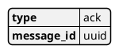

### nack
The nack message is used to non acknowledgements, message was unimplemented or unsuccessful.

|field | content | type | description |
| ---- | ------- | ---- | ----------- |
|type |nack |string  |The ack message type
|message_id |UUID |string  |message id that the nack is referring to

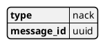

### register
The message is used to register a fin to SOARCA. It has the following payload. 

|field              |content                |type               | description |
| ----------------- | --------------------- | ----------------- | ----------- |
|type               |register               |string             |The register message type
|message_id         |UUID                   |string             |Message UUID 
|fin_id             |UUID                   |string             |Fin uuid of the separate form the capability 
|protocol_version   |version                |string             |Version information of the protocol in [semantic version](https://semver.org) schema e.g. 1.2.4-beta
|security           |security information   |<<Security>>           |ecurity information for protocol see security structure
|capabilities       |list of capability structure    |list of <<capability structure>>    |Capability structure information for protocol see security structure
|meta   |meta dict |<<Meta>> |Meta information for the fin protocol structure

#### capability structure

|field              |content        |type    | description |
| ----------------- | ------------- | ------ | ----------- |
|capability_id      |UUID           |string  |Capability id to identify the unique capability a fin can have multiple
|type               |action         | [workflow-step-type-enum](https://docs.oasis-open.org/cacao/security-playbooks/v2.0/cs01/security-playbooks-v2.0-cs01.html#_Toc152256479) | Most common is action
|name               |name           |string  |message id 
|version            |version        |string  |Version information of the Fin implementation used in [semantic version](https://semver.org) schema e.g. 1.2.4-beta
|step               |step structure |<<step structure>>    |Step to specify an example for the step so it can be queried in the SOARCA API
|agent              |agent structure|<<agent structure>>   |Agent to specify the agent definition to match in playbooks for SOARCA 

#### step structure
|field              |content        |   type            | description |
| ----------------- | ------------- | ----------------- | ----------- |
|type               |action         |string                     |Action type 
|name               |name           |string                     |message id 
|description        |description    |string                     |Description of the step 
|external_references|<references>   |[external reference](https://docs.oasis-open.org/cacao/security-playbooks/v2.0/cs01/security-playbooks-v2.0-cs01.html#_Toc152256542) |References to external recourses to further enhance the step also see CACAO V2 10.9.
|command            |command        |string                     |Command to execute
|target             |UUID           |string                     |Target UUID cto execute command against

#### agent structure

|field              |content        |   type            | description |
| ----------------- | ------------- | ----------------- | ----------- |
|type               |soarca-fin     |string     |SOARCA Fin type, a custom type used to specify Fins
|name               |name           |string     |SOARCA Fin name in the following form: soarca-fin-<name>-<uuid>, this grantees the fin is unique

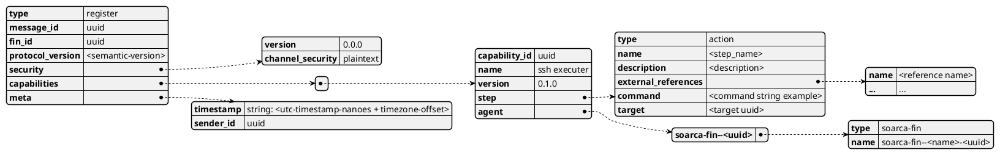

                

### unregister
The message is used to unregister a fin to SOARCA. It has the following payload.

|field              |content        |type    | description |
| ----------------- | ------------- | ------ | ----------- |
|type           |unregister     |string     |Unregister message type
|message_id     |UUID           |string     |Message UUID 
|capability_id  |UUID           |string     |Capability id or null (either capability_id != null, fin_id != null or all == true need to be set)
|fin_id         |UUID           |string     |Fin id or null (either capability_id != null, fin_id != null or all == true need to be set)
|all            |bool           |bool       |True to address all fins to unregister otherwise false (either capability_id != null, fin_id != null or all == true need to be set)

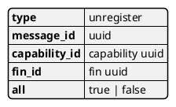

### command
The message is used to send a command from SOARCA. It has the following payload. 

|field              |content        |type    | description |
| ----------------- | ------------- | ------ | ----------- |
|type               |unregister     |string     |Unregister message type
|message_id         |UUID           |string     |Message UUID 
[Authentication information] |Additional authentication information the field is optional 
|command            |command        |<<command substructure>> |command structure
|meta   |meta dict |<<Meta>> |Meta information for the fin protocol structure
|===

#### command substructure
|field              |content        |type    | description |
| ----------------- | ------------- | ------ | ----------- |
|command            |command        |string     |The command to be executed
|authentication `(optional)`    |authentication information | [authentication information](https://docs.oasis-open.org/cacao/security-playbooks/v2.0/cs01/security-playbooks-v2.0-cs01.html#_Toc152256503) | CACAO authentication information
|context            |cacao context  |<<Context>> | Context form the playbook
|variables          |dict of variables      |dict of <<Variables>> | From the playbook

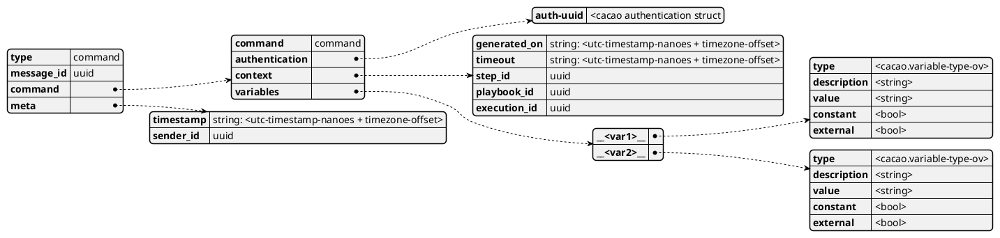

### result
The message is used to send response from the Fin to SOARCA. It has the following payload.

|field              |content        |type    | description |
| ----------------- | ------------- | ------ | ----------- |
|type               |result     |string     |Unregister message type
|message_id         |UUID       |string     |Message UUID 
|result             |result structure |<<result structure>> | The result of the execution 
|return             |dict of variables        |<<command substructure>> |command structure 

#### result structure
|context            |cacao context  |<<Context>> | Context form the playbook

|field              |content        |type    | description |
| ----------------- | ------------- | ------ | ----------- |
|type               |result     |string     |Unregister message type
|result            |result structure |<<result structure>> | The result of the execution 

|return             |dict of variables        |<<command substructure>> |command structure 

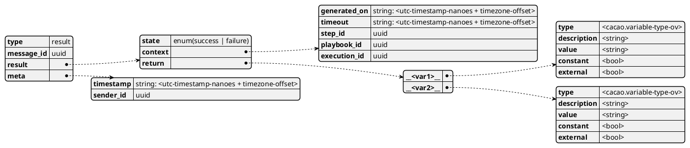

### control
|field              |content        |type    | description |
| ----------------- | ------------- | ------ | ----------- |
|type            |pause or resume or stop or progress    |string     |Message type
|message_id                 |UUID           |string     |message uuid 
|capability_id            |UUID        |string     |Capability uuid to control

#### pause
The message is used to halt the further execution of the Fin. Following command will be responded to with nack, unless it is resume or stop.

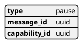

#### resume
The message is used to resume a paused Fin, the response will be ack if ok or nack when the Fin could not be resumed.

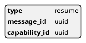

#### stop
The message is used to shutdown the Fin. this will be responded to by ack, after that there will follow an unregister. 

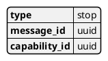

#### progress
Ask for the progress of the execution of the 
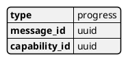

### Status response
|field              |content        |type    | description |
| ----------------- | ------------- | ------ | ----------- |
|type            |status    |string     |Message type
|message_id                 |UUID           |string     |message uuid 
|capability_id            |UUID        |string     |Capability uuid to control
|progress            |ready, working, paused, stopped       |string     |Progress of the execution or state it's in.

Report the progress of the execution of the capability

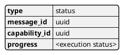

### Common
These contain command parts that are used in different messages.

#### Security
|field              |content        |type    | description |
| ----------------- | ------------- | ------ | ----------- |
|version            |version        |string |Version information of the protocol in [semantic version](https://semver.org) schema e.g. 1.2.4-beta
|channel_security   |plaintext      |string |Security mechanism used for encrypting the channel and topic, plaintext is only supported at this time

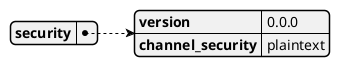

#### Variables
Variables information structure

|field              |content        |type    | description |
| ----------------- | ------------- | ------ | ----------- |
|type |variable type |[variable-type-ov](https://docs.oasis-open.org/cacao/security-playbooks/v2.0/cs01/security-playbooks-v2.0-cs01.html#_Toc152256556)  | The cacao variable type see CACAO V2 chapter 10.18, 10.18.4 Variable Type Vocabulary
|description        |description    |string                     |Description of the step 
|value              |value          |string                     |Value of the variable 
|constant           |true or false  |bool                       |whether it is constant  
|external           |true or false  |bool                       |whether it is external to the playbook

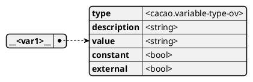

#### Context
CACAO playbook context information structure

|field              |content        |type    | description |
| ----------------- | ------------- | ------ | ----------- |
|completed_on `(optional)` |timestamp |string  | <utc-timestamp-nanoes + timezone-offset>
|generated_on `(optional)` |timestamp |string  | <utc-timestamp-nanoes + timezone-offset>
|timeout `(optional)` |duration |string  | <utc-timestamp-nanoes + timezone-offset>
|step_id |UUID |string  |Step uuid that is referred to
|playbook_id  |UUID |string  |Playbook uuid that is referred to
|execution_id  |UUID |string  |SOARCA execution uuid

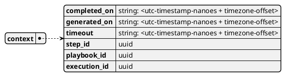

#### Meta
Meta information for the fin protocol structure

|field              |content        |type    | description |
| ----------------- | ------------- | ------ | ----------- |
|timestamp      |timestamp |string  | <utc-timestamp-nanoes + timezone-offset>
|sender_id      |UUID |string  |Step uuid that is referred to

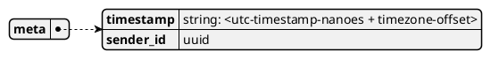

## Sequences

### Registering a capability

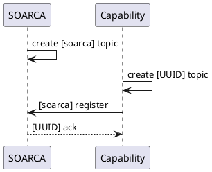

### Sending command

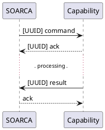

### Unregistering a capability

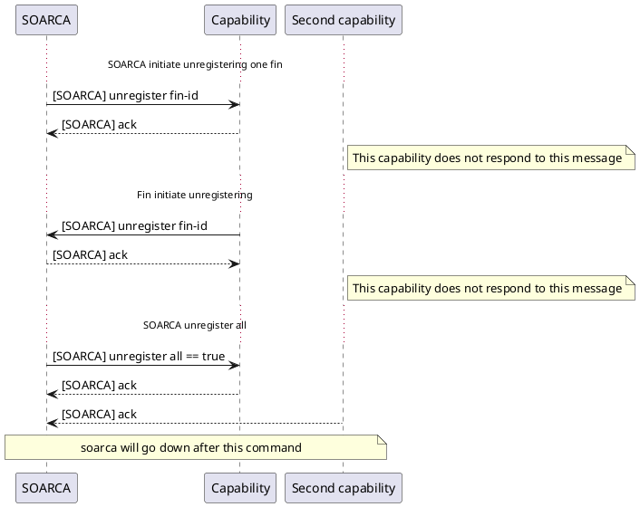

### Control

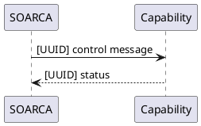

