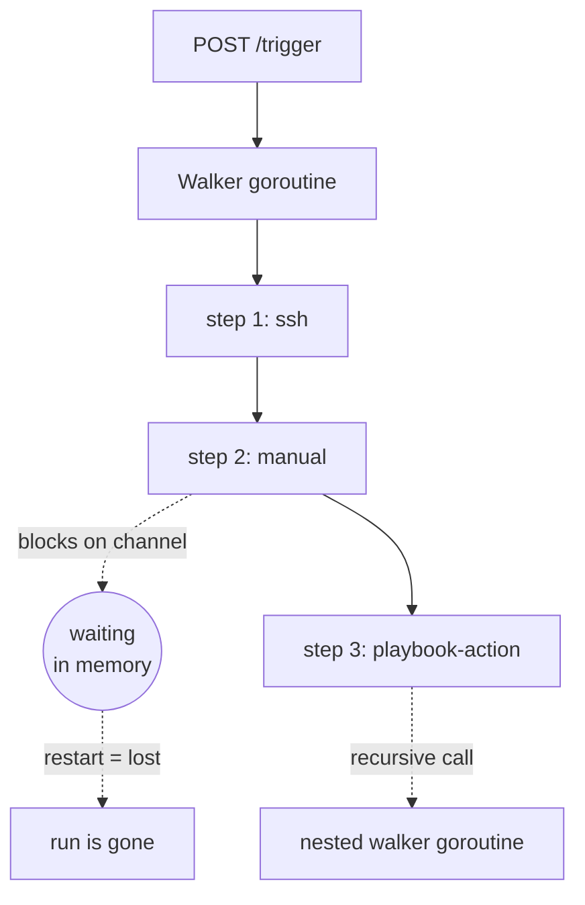
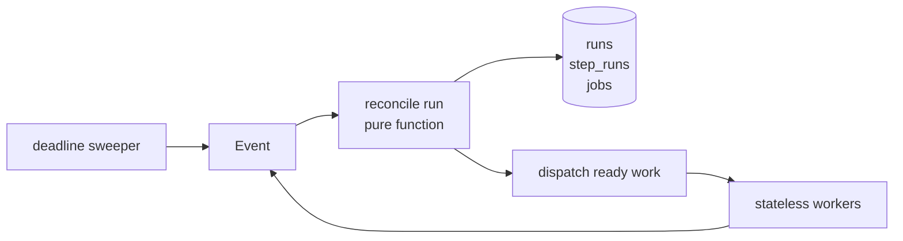
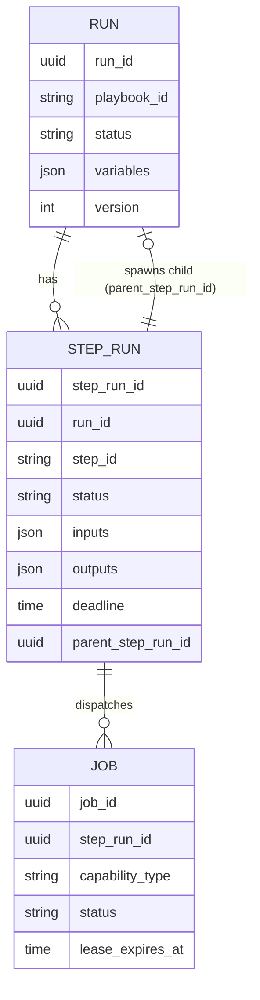
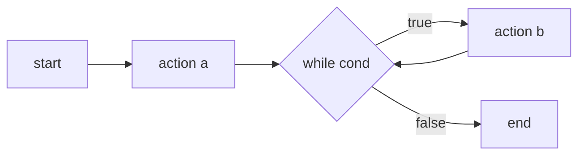
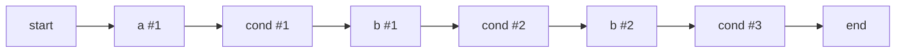

# Durable playbook execution — design notes

Working document. Move it into `docs/` or `issue-drafts/` if you want it tracked.

## Why change anything

Four requirements the current design cannot meet:

1. **Survive a restart.** A playbook run that is halfway through must continue after
   SOARCA restarts.
2. **Resume from a step.** After a failure, re-run from the failed step — not the whole
   playbook. Manual steps can take hours or days; re-running everything is not viable.
3. **Run steps in parallel.** CACAO defines a `parallel` step type. Today it is silently
   skipped.
4. **Trace nested playbooks.** A sub-playbook must be traceable to the step that started it.

## The one idea

> **Waiting becomes a row in a database, not a goroutine blocked on a channel.**

Everything else follows from that sentence.

Today, "where we are in the playbook" lives in a Go call stack: a `for` loop in
`ExecuteBranch`, local variables, and recursion into sub-playbooks. A call stack cannot be
written to a database, so it cannot survive a restart. That is the whole problem.

If instead the position is stored as data — "run 7 is waiting on step-run 12, deadline
14:05" — then a restart is uninteresting. You read the row and carry on.

## Now vs proposed

Today, one goroutine per run walks the graph and blocks whenever a step waits:



Proposed: a stateless loop over durable state.



An *event* is anything that might let a run move: it was triggered, a FIN returned a
result, an operator answered a manual step, a child run finished, or a deadline passed.

## Data model

Three tables. That is the whole engine's memory.



`RUN.parent_step_run_id` is how requirement 4 is met: a nested playbook is a normal run
that happens to know which step-run created it. Tracing is then a tree walk.

## The loop

One function, called whenever an event arrives:

```
reconcile(run):
    load run + its step_runs
    mark finished work, record outputs
    find steps whose predecessors are all done
    dispatch them (write jobs, set deadlines)
    if nothing left running -> mark run finished
    save with optimistic lock
```

It never blocks and never sleeps. It is a pure function from state to "what to do next",
which makes it trivial to unit test: feed it a state, assert the dispatch list.

**The rule that keeps this honest: `reconcile` must never block.** The moment one step type
blocks a goroutine, durability is lost again.

## How each step type finishes

All four look identical to the engine — a step-run moves out of `waiting`:

| Step type | Dispatched as | Completed by |
|---|---|---|
| ssh / http / openc2 / powershell | job for an in-process worker | worker posts result |
| fin | job on the queue | external FIN submits result |
| manual | pending command | operator `PUT /manual/{run_id}/{step_run_id}` |
| playbook-action | child run with `parent_step_run_id` | child run reaches an end state |

This is the unification. Today these are three unrelated mechanisms (channel, queue,
recursion) with three different timeout stories (context timeout, lease + heartbeat, none
at all). Afterwards there is one mechanism and one timeout: a `deadline` column and a
sweeper that fails or retries whatever is past it.

## Temporal vs hand-rolled

Temporal Server and all SDKs are open source (MIT) and free to self-host. Temporal Cloud is
a paid managed option. The cost is therefore operational, not licensing: a Temporal server
plus a backing database (PostgreSQL/MySQL/Cassandra), and Elasticsearch for advanced
visibility. Local dev is a single binary (`temporal server start-dev`, SQLite).

It maps well onto our requirements:

| Requirement | Temporal |
|---|---|
| Survive restart | native |
| Resume from a step | `workflow reset` rewinds to a point in history |
| Parallel steps | native |
| Nested playbook traceability | child workflows, parent linkage built in |
| Manual steps lasting days | signals + durable timers — a canonical use case |

Capabilities map onto activities almost one-to-one. FIN fits async activity completion.

Arguments against, in order of weight:

1. **Deployment footprint.** SOARCA ships today as one Go binary plus optional MongoDB.
   Requiring adopters to run a Temporal cluster (and a second datastore, since Temporal
   does not use MongoDB) is a real adoption cost for an open-source SOAR. Tracecat accepted
   this trade; whether we should is a product question, and it should be answered *before*
   the spike because it may decide the outcome regardless of how the code goes.
2. **Determinism and versioning discipline** — see below.
3. Another datastore to operate and back up.

### Playbooks are data, not code — and that helps

Temporal's model is "workflow as code", but CACAO playbooks are an interpreted graph. So we
would write *one* interpreter workflow that walks the playbook and calls activities per
step, rather than a workflow per playbook.

This is less of a problem than it first appears, because **playbooks are uploaded and
versioned**. Pin the playbook (or its hash) as workflow input at run start:

- Running a different playbook is *different input*, not different code. No versioning API.
- Editing a playbook after a run started cannot corrupt replay, because the run carries the
  version it began with.
- Temporal's versioning tax then applies only when *we* change interpreter logic in a way
  that alters the sequence of commands issued — far rarer than playbook edits.

That reduces the second objection considerably.

### What actually breaks determinism

Variable interpolation is *not* a determinism problem — it is pure string replacement. The
real sources in today's code are:

| Code | Problem | Temporal equivalent |
|---|---|---|
| `decomposer.guid.New()` (run + step ids) | random | `workflow.SideEffect` / deterministic ids |
| `decomposer.time.Now()` (all reporter calls) | wall clock | `workflow.Now()` |
| `decomposer.time.Sleep(step.Delay)` | real sleep | `workflow.Sleep` (durable timer) |
| reporter chain → TheHive HTTP | I/O inside the walk | must become an activity |
| `Variables.Merge` on key conflict | map order dependent | make merge order explicit |

None are hard, but they must be done deliberately. The TheHive reporter is the one that
needs restructuring rather than a one-line swap.

### Where to interpolate variables — resolve late

Today `action.go` interpolates commands, targets **and authentication** immediately before
calling the capability (`interpolateAuthentication` covers username, password, token,
private key, oauth header).

Interpolating early is not required, and doing it late is better for two reasons:

1. **Secrets.** If interpolation happens in workflow code, resolved passwords, tokens and
   private keys are written into Temporal's durable event history. Resolving inside the
   activity keeps credentials out of persisted history. The same argument applies to our own
   `step_runs.inputs` column in the hand-rolled design.
2. **Smaller determinism surface.** Less logic in workflow code means fewer ways to break
   replay and fewer forced versionings.

The tension is auditability: step reports carry `commands_b64`, and a SOAR must record what
actually ran. Resolve the command inside the activity, then return the resolved command in
the activity result for the audit trail — but redact anything that came from an
authentication field.

Related gap: `cacao.Variable` has `Type`, `Name`, `Description`, `Value`, `Constant` and
`External`, but **no way to mark a variable sensitive**. Without that, we cannot
automatically decide what to redact from reports or history. Worth adding as a SOARCA
extension.

### Suggested spike shape

The `runs.Runner` boundary makes this decision reversible, so timebox hard rather than
running a two-way bake-off:

- **Week 1, Temporal only.** One vertical slice: trigger → ssh step → manual step → kill
  the server → restart → operator answers → run completes, plus a nested playbook as a
  child workflow. If that lands cleanly, stop; you have the answer.
- **Only if it does not**, spend week 2 on the hand-rolled version (three tables, one
  `reconcile`, a poller, a sweeper).

Agree the decision criteria up front or the spike ends in a vibe. Proposed: does
resume-from-step work without replaying side effects; can an adopter still deploy with one
`docker compose up`; what is the upgrade burden; how hard is it to evolve the interpreter
with runs in flight; how much code do we own afterwards.

Either option needs the explicit `in_args`/`out_args` model below. Temporal will not model
CACAO variable scoping for us.

## Variables

CACAO already specifies this and we currently implement half of it.

- `in_args` — what a step reads. **Defined in our model, never used.**
- `out_args` — what a step exports. Used today.

Today all variables are merged into one flat map, so everything is effectively global.
That breaks two things: parallel branches writing the same variable race, and you cannot
reconstruct the inputs of step N without replaying steps 1..N-1.

Proposed: persist per step-run the resolved `inputs` and the declared `outputs`. A step's
scope is then *run variables + outputs of its ancestors*, computed from data.

This is the same model as GitHub Actions (`steps.<id>.outputs.<name>`) and GitLab CI
(`artifacts:reports:dotenv` flowing to jobs that declare `needs:`). Neither lets outputs
leak implicitly.

**This is not a nice-to-have: it is what makes requirement 2 possible.** You cannot resume
at step N unless you stored the scope entering step N.

## Conditions, replay and the run graph

### Reading the world is an activity

Conditions come in two shapes:

- **Over variables we already hold.** Today's if/while steps evaluate a STIX comparison
  against `cacao.Variables` produced by earlier steps. Those values are recorded, so the
  condition evaluates identically on replay. Already safe.
- **Needing fresh external state** ("is the host still infected?"). That is I/O, so it must
  be an activity. It runs once, the answer is recorded, and the branch is taken on the
  recorded value.

The rule is the same one as everywhere else: **reading the world is an activity; deciding is
workflow code.**

### Replay is not re-execution

> Replay reconstructs what already happened. It never re-checks the world.

If the world changed after a check, the branch does not retroactively change. That is
correct: a playbook that quarantined a host at 10:00 must not un-decide it during a replay
at 10:05.

This is a property of **durability, not of Temporal**. In the hand-rolled design the
condition outcome is stored on the `step_run` row and resuming reads the stored value.
Identical semantics either way.

### Stale conditions — an authoring pattern

A run can wait days on a manual step and then evaluate a condition against data captured
before the wait. Deterministically correct, possibly operationally wrong.

Fix in the playbook, not the engine: **when a condition must reflect current reality, put an
explicit refresh action step immediately before it.** The author controls when reality is
sampled, which is better than an engine that silently re-samples.

To make a *running* playbook react to an external change, send it a signal (Temporal) or
raise an event that triggers `reconcile` (hand-rolled). That is also how cancellation works.

### Stored decisions stand

On resume, previously recorded branch decisions are authoritative. An operator who wants
fresh evaluation starts a new run.

This matches GitLab CI and GitHub Actions: retrying a failed job re-runs that job and the
jobs that depend on it, never earlier ones. Silent divergence in a security tool's audit
log is worse than an extra button.

### The playbook graph has cycles; the run graph does not

A playbook may loop. A *run* never does — revisiting a step produces a **new step run**,
because causality only moves forward.

Playbook graph (static, cyclic):



Run graph (unrolled, acyclic):



The current code already assumes this: `decomposer.newStepMetadata` mints a fresh
`StepExecutionId` per invocation, explicitly so that loop iterations stay distinct.

Consequences:

1. **Resume targets a step *run*, not a step.** If a step ran five times, "resume from step
   b" is ambiguous. The API takes `step_run_id`.
2. **Loop iteration, retry and resume are one mechanism.** All three create a new step run
   for the same `step_id`. A retry is just a step run with a `retry_of` link; nothing is
   mutated in place, so the audit trail stays append-only.
3. **Retry invalidates descendants, not ancestors.** Step runs causally downstream of a
   retried step are superseded and re-created; earlier ones are untouched.

### Lineage

To know what to invalidate on retry, record *which step run produced each input*. If we
store resolved `inputs` per step run (see Variables), storing the producing `step_run_id`
alongside costs almost nothing and yields a precise dependency graph.

That is also data lineage — for a security tool, "where did this value come from?" is
worth having for its own sake.

## Restart and resume

On boot: find runs that are not finished, re-dispatch anything `ready`, re-arm deadlines.
Manual steps need no special handling — they were `waiting` before the restart and still
are.

Resume-from-step after a failure: create a new step run for the failed step, leave earlier
step runs untouched, supersede those causally downstream, reconcile. Because inputs are
stored, the step can run without replaying its predecessors.

## Concurrency

Two events can hit one run at the same instant — for example a FIN result arriving exactly
as the sweeper decides the step timed out. Without protection both proceed and the next
step is dispatched twice.

Fix: a `version` column. Read at version 7, compute, `UPDATE ... WHERE version = 7`. If
another writer won, zero rows change; re-read and retry. (Alternative: one consumer per
run, partitioned by `run_id`. Either works — pick one on purpose.)

## Is this a known pattern?

Yes. This is a **durable workflow engine**, and every part has a standard name:

| What we are doing | Established name | Prior art |
|---|---|---|
| State in a DB, stateless loop converges it | **Reconciliation / level-triggered control loop** | Kubernetes controllers |
| Central component decides the next step | **Orchestration** (vs choreography) | Temporal, Step Functions, Conductor |
| Work claimed with a lease that expires | **Lease / visibility timeout** | SQS, our own FIN queue |
| `UPDATE ... WHERE version = n` | **Optimistic concurrency control** | standard RDBMS practice |
| Re-dispatch may repeat work | **At-least-once + idempotency keys** | Stripe, SQS |
| Rebuild state from recorded facts | **Event sourcing** | Temporal, Cadence |

The closest mental model is a **CI system**, which is where the instinct to copy GitLab is
correct: GitLab CI is a stateless Rails app, state in Postgres, and stateless runners that
poll for jobs and hold leases. That is exactly the shape above.

## What we are deliberately not doing

- Not doing compensation/rollback (**Saga** pattern). Out of scope until asked for.
- Not building a distributed scheduler. One process reconciling is fine; the model allows
  more later without redesign.

## Cheapest viable version (hand-rolled option)

This does not have to be big:

- 3 tables
- 1 `reconcile` function
- 1 poller that claims dispatched jobs
- 1 sweeper for expired deadlines

The FIN queue already implements claim, lease, expiry and requeue. Backing that with
storage instead of a map is most of the job.

## Open decisions

1. **Retry grain.** Step-level (like GitLab jobs) or per command/target? Per-command needs
   `command_run` rows, and CACAO does not define partial step success — that policy would
   be ours to invent. Suggest: record command rows for visibility, retry at step level
   first.
2. **Idempotency.** Re-dispatch after a crash can re-run a step. `step_run_id` is a natural
   idempotency key, but an SSH command is not idempotent. Needs a per-capability policy.
3. **Storage backend.** We use MongoDB. Durable queues are more ergonomic on Postgres
   (`FOR UPDATE SKIP LOCKED`); on Mongo it is `findAndModify` with lease fields — workable,
   easier to get subtly wrong. Choose with the queue in mind.
4. **Migration.** Build behind `runs.Runner` as a second implementation, switch by config,
   delete the old walker once it passes the same tests.
